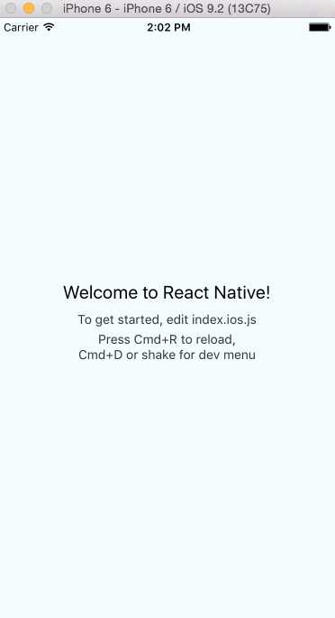
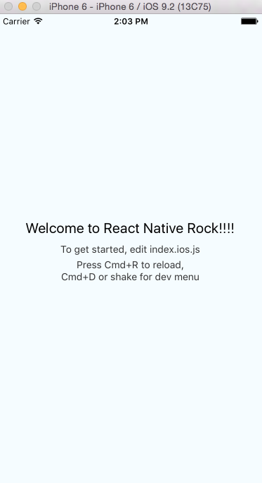
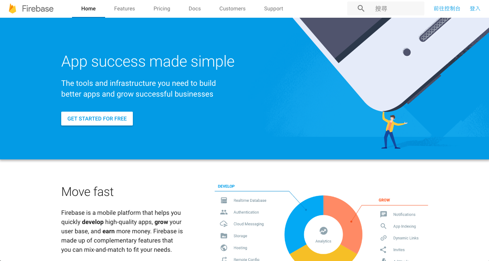
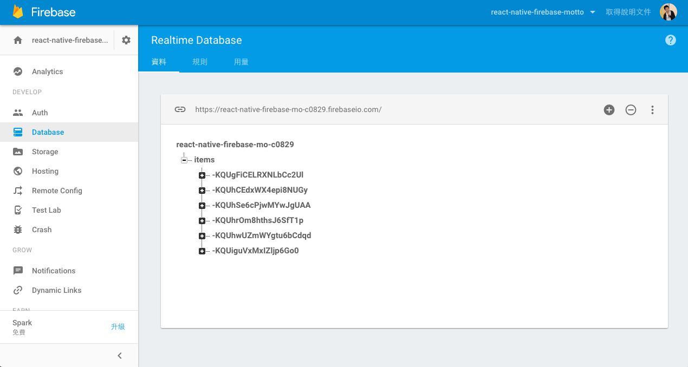

# 附錄二、用 React Native + Firebase 開發跨平台行動應用程式


## 前言
跨平台（`Wirte once, Run Everywhere`）一直以來是軟體工程的聖杯。過去一段時間市場上有許多嘗試跨平台開發原生行動裝置（Native Mobile App）的解決方案，嘗試運用 HTML、CSS　和 JavaScript 等網頁前端技術達到跨平台的效果，例如：運用 [jQuery Mobile](https://jquerymobile.com/)、[Ionic](http://ionicframework.com/) 和 [Framework7](http://framework7.io/) 等 Mobile UI 框架（Framework）結合 JavaScript 框架並搭配 [Cordova/PhoneGap](https://en.wikipedia.org/wiki/Apache_Cordova) 進行跨平台行動裝置開發。然而，因為這些解決方案通常都是運行在 `WebView` 之上，導致效能和體驗要真正趨近於原生應用程式（Native App）還有一段路要走。

不過，隨著 Facebook 工程團隊開發的 [React Native](https://facebook.github.io/react-native/) 橫空出世，想嘗試跨平台解決方案的開發者又有了新的選擇。

## React Native 特色
1. 使用 JavaScript（ES6+）和 [React](https://facebook.github.io/react/) 打造跨平台原生應用程式（Learn once, write anywhere）
2. 使用 Native Components，更貼近原生使用者體驗
3. 在 JavaScript 和 Native 之間的操作為非同步（Asynchronous）執行，並可用 Chrome 開發者工具除錯，支援 Hot Reloading
4. 使用 [Flexbox](https://developer.mozilla.org/en-US/docs/Web/CSS/CSS_Flexible_Box_Layout/Using_CSS_flexible_boxes) 進行排版和布局
5. 良好的可擴展性（Extensibility），容易整合 Web 生態系標準（XMLHttpRequest、 navigator.geolocation 等）或是原生的元件或函式庫（Objective-C、Java 或 Swift）  
6. Facebook 已使用 React Native 於自家 Production App 且將持續維護，另外也有持續蓬勃發展的技術社群
7. 讓 Web 開發者可以使用熟悉的技術切入 Native App 開發
8. 2015/3 釋出 iOS 版本，2015/9 釋出 Android 版本
9. 目前更新速度快，平均每兩週發佈新的版本。社群也還持續在尋找最佳實踐，關於版本進展可以[參考這個文件](https://facebook.github.io/react-native/versions.html)
10. 支援的作業系統為 >= Android 4.1 (API 16) 和 >= iOS 7.0

相信看到這裡讀者們一定等不及想大展身手，使用 React Native 開發你第一個 App。俗話說學習一項新技術最好的方式就是做一個 TodoApp。所以，接下來的文章，筆者將帶大家使用 React Native 結合 Redux 開發一個記錄名言佳句的 Mobile App！

## 專案成果截圖


## React Native 環境設定
You will need Android Studio, node.js, the React Native command line tools, and Watchman.

```
brew install node
brew install watchman
```

```
npm install -g react-native-cli
```

```
// 注意不能使用 - 或 _
$ react-native init ReactNativeFirebaseMotto
$ cd ReactNativeFirebaseMotto
```

若你是使用 Mac OS 作業系統的話可以執行 `run-ios`，若 `run-android`：
```
$ react-native run-ios
// Genymotion
$ react-native run-android
```

如果一切順利的話就可以在模擬器中看到初始畫面：



由於 React Native 有支援 `Hot Reloading`，若我們更改了檔案內容，我們可以使用 `Cmd+R` 刷新頁面，此時就可以在看到原本的 `Welcome to React Native!` 文字已經改成 `Welcome to React Native Rock!!!! `

有沒有感覺在開發網頁的感覺？



```
npm install firebase --save
```




## 環境安裝與設定
1. 安裝 Node 和 NPM

2. 安裝所需套件

```
$ npm install --save redux react-redux immutable redux-immutable redux-actions uuid react-native-vector-icons
```

```
$ npm install --save-dev babel-core babel-eslint babel-loader babel-preset-es2015 babel-preset-react babel-preset-react-native eslint-plugin-react-native  eslint eslint-config-airbnb eslint-loader eslint-plugin-import eslint-plugin-jsx-a11y eslint-plugin-react webpack webpack-dev-server redux-logger
```

## React Native 初體驗

```javascript
import React, { Component } from 'react';
import { Text, View } from 'react-native';

class WhyReactNativeIsSoGreat extends Component {
  render() {
    return (
      <View>
        <Text>
          If you like React on the web, youll like React Native.
        </Text>
        <Text>
          You just use native components like View and Text,
          instead of web components like div and span.
        </Text>
      </View>
    );
  }
}
```

```javascript
import React, { Component } from 'react';
import { Image, ScrollView, Text } from 'react-native';

class AwkwardScrollingImageWithText extends Component {
  render() {
    return (
      <ScrollView>
        <Image source={{uri: 'https://i.chzbgr.com/full/7345954048/h7E2C65F9/'}} />
        <Text>
          On iOS, a React Native ScrollView uses a native UIScrollView.
          On Android, it uses a native ScrollView.
          On iOS, a React Native Image uses a native UIImageView.
          On Android, it uses a native ImageView.
          React Native wraps the fundamental native components, giving you
          the performance of a native app, plus the clean design of React.
        </Text>
      </ScrollView>
    );
  }
}
```

```javascript
import React, { Component } from 'react';
import { Text, View } from 'react-native';
import { TheGreatestComponentInTheWorld } from './your-native-code';

class SomethingFast extends Component {
  render() {
    return (
      <View>
        <TheGreatestComponentInTheWorld />
        <Text>
          TheGreatestComponentInTheWorld could use native Objective-C,
          Java, or Swift - the product development process is the same.
        </Text>
      </View>
    );
  }
}
```

## 使用 Flexbox 進行 UI 布局設計 

在 React Native 中使用 `Flexbox` 進行排版，若你對於 Flexbox 尚不熟悉，建議可以[參考這篇文章](https://css-tricks.com/snippets/css/a-guide-to-flexbox/)，若有需要遊戲化的學習工具，也非常推薦這兩個教學小遊戲：[FlexDefense](http://www.flexboxdefense.com/)、[FLEXBOX FROGGY](http://flexboxfroggy.com/)。


## 動手實作

### 設定 Firebase

```javascript
{
  "rules": {
    ".read": true,
    ".write": true
  }
}
```

## 在模擬器和實機上看成果

## 總結




## 延伸閱讀
1. [React Native 官方網站](https://facebook.github.io/react-native/)
2. [React 官方網站](https://facebook.github.io/react/)
3. [Redux 官方文件](http://redux.js.org/index.html)
4. [Ionic Framework vs React Native](https://medium.com/react-id/ionic-framework-hybrid-app-vs-react-native-4facdd93f690#.eh74uqqlk)
5. [How to Build a Todo App Using React, Redux, and Immutable.js](https://www.sitepoint.com/how-to-build-a-todo-app-using-react-redux-and-immutable-js/)
6. [Your First Immutable React & Redux App](https://reactjsnews.com/your-first-redux-app)
7. [React, Redux and Immutable.js: Ingredients for Efficient Web Applications](https://www.toptal.com/react/react-redux-and-immutablejs)
8. [Full-Stack Redux Tutorial](http://teropa.info/blog/2015/09/10/full-stack-redux-tutorial.html)
9. [redux与immutable实例](http://react-china.org/t/redux-immutable/2431)
10. [gajus/redux-immutable](https://github.com/gajus/redux-immutable)
11. [acdlite/redux-actions](https://github.com/acdlite/redux-actions)
12. [Flux Standard Action](https://github.com/acdlite/flux-standard-action)
13. [React Native ImmutableJS ListView Example](https://medium.com/front-end-hacking/react-native-immutable-listview-example-78662fa64a15#.1b3jtjghp)
14. [React Native 0.23.1 warning: 'In next release empty section headers will be rendered'](https://github.com/FaridSafi/react-native-gifted-listview/issues/39)
15. [js.coach](https://js.coach/)
16. [React Native Package Manager](https://github.com/rnpm/rnpm)
17. [React Native 学习笔记](https://github.com/crazycodeboy/RNStudyNotes)
18. [The beginners guide to React Native and Firebase](https://firebase.googleblog.com/2016/01/the-beginners-guide-to-react-native-and_84.html)
19. [Authentication in React Native with Firebase](https://www.sitepoint.com/authentication-in-react-native-with-firebase/)
20. [bruz/react-native-redux-groceries](https://github.com/bruz/react-native-redux-groceries)
21. [Building a Simple ToDo App With React Native and Firebase](https://devdactic.com/react-native-firebase-todo/)
22. [Firebase Permission Denied](http://stackoverflow.com/questions/37403747/firebase-permission-denied)
23. [Best Practices: Arrays in Firebase](https://firebase.googleblog.com/2014/04/best-practices-arrays-in-firebase.html)

(image via [moduscreate](http://moduscreate.com/wp-content/uploads/2015/07/ReactNativelogo.png))
