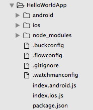
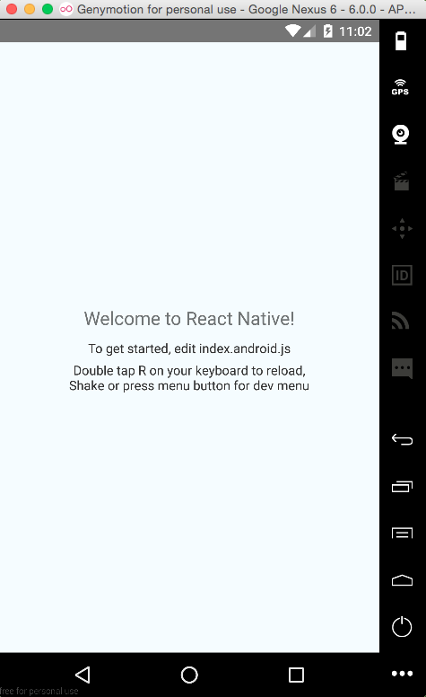
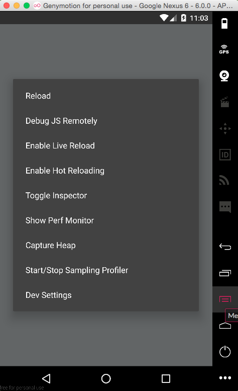
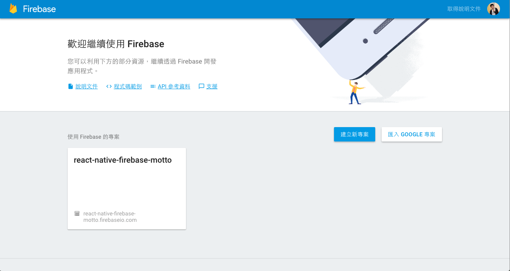
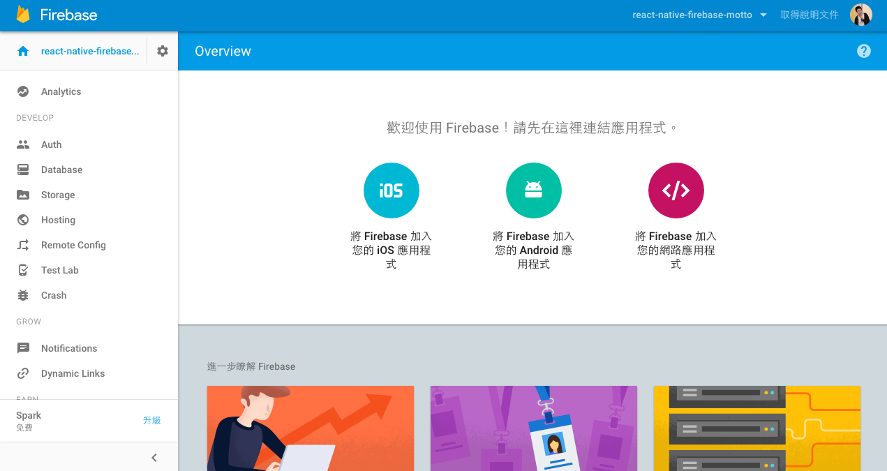
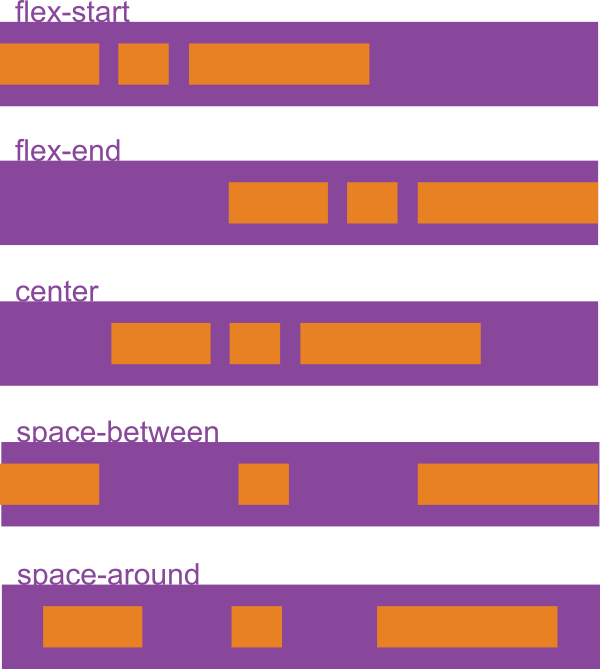
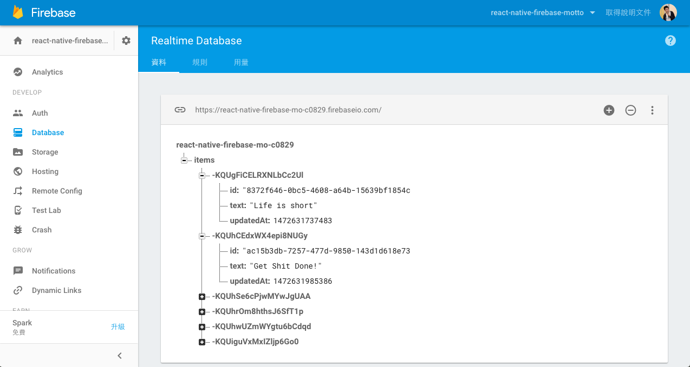

# 附录二、用 React Native + Firebase 开发跨平台行动应用程序


## 前言
跨平台（`Wirte once, Run Everywhere`）一直以来是软体工程的万金油。过去一段时间市场上有许多尝试跨平台开发原生手机应用（Native Mobile App）的解决方案，尝试运用 HTML、CSS　和 JavaScript 等网页前端技术达到跨平台的效果，例如：运用 [jQuery Mobile](https://jquerymobile.com/)、[Ionic](http://ionicframework.com/) 和 [Framework7](http://framework7.io/) 等 Mobile UI 框架（Framework）结合 JavaScript 框架并搭配 [Cordova/PhoneGap](https://en.wikipedia.org/wiki/Apache_Cordova) 进行跨平台手机应用开发。然而，因为这些解决方案通常都是运行在 `WebView` 之上，导致性能和体验要真正趋近于原生应用程序（Native App）还有一段路要走。

但是，随著 Facebook 工程团队开发的 [React Native](https://facebook.github.io/react-native/) 横空出世，想尝试跨平台解决方案的开发者又有了新的选择。

## React Native 特色
在正式开始开发 React Native App 之前我们先来介绍一下 React Native 的主要特色：

1. 使用 JavaScript（ES6+）和 [React](https://facebook.github.io/react/) 打造跨平台原生应用程序（Learn once, write anywhere）
2. 使用 Native Components，更贴近原生使用者体验
3. 在 JavaScript 和 Native 之间的操作为非同步（Asynchronous）执行，并可用 Chrome 开发者工具除错，支持 `Hot Reloading`
4. 使用 [Flexbox](https://developer.mozilla.org/en-US/docs/Web/CSS/CSS_Flexible_Box_Layout/Using_CSS_flexible_boxes) 进行排版和布局
5. 良好的可扩展性（Extensibility），容易整合 Web 生态系标准（XMLHttpRequest、 navigator.geolocation 等）或是原生的组件或函数库（Objective-C、Java 或 Swift）  
6. Facebook 已使用 React Native 于自家 Production App 且将持续维护，另外也有持续蓬勃发展的技术社群
7. 让 Web 开发者可以使用熟悉的技术切入 Native App 开发
8. 2015/3 发布 iOS 版本，2015/9 发布 Android 版本
9. 目前更新速度快，平均每两周发布新的版本。社群也还持续在寻找最佳实践，关于版本进展可以[参考这个文件](https://facebook.github.io/react-native/versions.html)
10. 支持的操作系统为 >= Android 4.1 (API 16) 和 >= iOS 7.0

## React Native 初体验
在了解了 React Native 特色后，我们准备开始开发我们的 React Native 应用程序！由于我们的范例可以让程序跨平台共用，所以你可以使用 iOS 和 Android 平台运行。不过若是想在 iOS 平台开发需要先准备 Mac OS 和安装 [Xcode](https://developer.apple.com/xcode/) 开发工具，若是你准备使用 Android 平台的话建议先行安装 [Android Studio](https://developer.android.com/studio/index.html) 和 [Genymotion 模拟器](https://www.genymotion.com/)。在我们范例我们使用笔者使用的 MacO OS 操作系统并使用 Android 平台为主要范例，若有其他操作系统需求的读者可以参考 [官方安装说明](https://facebook.github.io/react-native/docs/getting-started.html)。

一开始请先安装 [Node](https://nodejs.org/en/)、[Watchman](https://facebook.github.io/watchman/) 和 React Native command line 工具：

```
// 若你使用 Mac OS 你可以使用官网安装方式或是使用 homebrew 安装
$ brew install node
// watchman 可以监看文件是否有修改
$ brew install watchman
```

```
// 安装 React Native command line 工具
$ npm install -g react-native-cli
```

由于我们是要开发 Android 平台，所以必须安装：
1. 安装 JDK
2. 安装 Android SDK
3. 设定一些环境变量

以上可以通过 [Install Android Studio](https://developer.android.com/studio/install.html) 官网和 [官方安装说明](https://facebook.github.io/react-native/docs/getting-started.html) 步骤完成。

现在，我们先通过一个简单的 `HelloWorldApp`，让大家感受一下 React Native 项目如何开发。

首先，我们先初始化一个 React Native Project：

```
$ react-native init HelloWorldApp
```

初始的文件夹结构：



接下来请先安装注册 [Genymotion](https://www.genymotion.com/)，Genymotion 是一个通过电脑模拟 Android 系统的好用开发模拟器环境。安装完后可以打开并选择需要使用的屏幕大小和 API 版本的 Android 系统。部署好开发环境后就可以启动我们的服务：


若你是使用 Mac OS 操作系统的话可以执行 `run-ios`，若是使用 Android 平台则使用 `run-android` 启动你的 App。在这边我们先使用 Android 平台进行开发（若你希望实机测试，请将电脑接上你的 Android 手机，记得确保 menu 中的 ip 地址要和电脑网络 相同。若是遇到连不到程序 server 且手机为 Android 5.0+ 系统，可以执行 `adb reverse tcp:8081 tcp:8081`，详细情形可以[参考官网说明](https://facebook.github.io/react-native/docs/running-on-device-android.html#using-adb-reverse)）：

```
$ react-native run-android
```

如果一切顺利的话就可以在模拟器中看到初始画面：



接著打开 `index.android.js` 就可以看到以下代码：
```javascript
import React, { Component } from 'react';
import {
  AppRegistry,
  StyleSheet,
  Text,
  View
} from 'react-native';

// 组件式的开发方式和 React 如出一辙，但要注意的是在 React Native 中我们不使用 HTML 元素而是使用 React Native 组件进行开发，这也符合 Learn once, write anywhere 的原则。
class HelloWorldApp extends Component {
  render() {
    return (
      <View style={styles.container}>
        <Text style={styles.welcome}>
          Welcome to React Native!
        </Text>
        <Text style={styles.instructions}>
          To get started, edit index.android.js
        </Text>
        <Text style={styles.instructions}>
          Double tap R on your keyboard to reload,{'\n'}
          Shake or press menu button for dev menu
        </Text>
      </View>
    );
  }
}

// 在 React Native 中 styles 是使用 JavaScript 形式来撰写，与一般 CSS 比较不同的是他使用驼峰式的属性命名：
const styles = StyleSheet.create({
  container: {
    flex: 1,
    justifyContent: 'center',
    alignItems: 'center',
    backgroundColor: '#F5FCFF',
  },
  welcome: {
    fontSize: 20,
    textAlign: 'center',
    margin: 10,
  },
  instructions: {
    textAlign: 'center',
    color: '#333333',
    marginBottom: 5,
  },
});

// 告诉 React Native App 你的进入点：
AppRegistry.registerComponent('HelloWorldApp', () => HelloWorldApp);
```

由于 React Native 有支持 `Hot Reloading`，若我们更改了程序内容，我们可以使用打开模拟器 Menu 重新刷新页面，此时就可以在看到原本的 `Welcome to React Native!` 文字已经改成 `Welcome to React Native Rock!!!! `




嗯，有没有感觉在开发网页的感觉？

## 动手实践
相信看到这里读者们一定等不及想大展身手，使用 React Native 开发你第一个 App。俗话说学习一项新技术最好的方式就是做一个 TodoApp。所以，接下来的文章，笔者将带大家使用 React Native 结合 Redux/ImmutableJS 和 Firebase 开发一个记录和删除名言佳句（Mottos）的 Mobile App！

### 项目成果截图


### 环境安装与设定

相关包安装：

```
$ npm install --save redux react-redux immutable redux-immutable redux-actions uuid firebase
```

```
$ npm install --save-dev babel-core babel-eslint babel-loader babel-preset-es2015 babel-preset-react babel-preset-react-native eslint-plugin-react-native  eslint eslint-config-airbnb eslint-loader eslint-plugin-import eslint-plugin-jsx-a11y eslint-plugin-react redux-logger
```

安装完相关工具后我们可以初始化我们项目：

```
// 注意项目不能使用 - 或 _ 命名
$ react-native init ReactNativeFirebaseMotto
$ cd ReactNativeFirebaseMotto
```

我们先准备一下我们文件夹架构，将它设计成：


### Firebase 简介与设定
在这个项目中我们会使用到 [Firebase](https://firebase.google.com/) 这个 `Back-End as Service`的服务，也就是说我们不用自己建立后端程序数据库，只要使用 Firebase 所提供的 API 就好像有了一个 NoSQL 数据库一样，当然 Firebase 不单只有提供数据储存的功能，但限于篇幅我们这边将只介绍数据储存的功能。 

1. 首先我们进到 Firebase 首页
  

2. 登入后点选建立项目，依照自己想取的项目名称命名

  

3. 选择将 Firebase 加入你的网络应用程序的按钮可以取得 App ID 的 config 数据，待会我们将会使用到

  

4. 点选左边选单中的 Database 并点选 Realtime Database Tab 中的规则

  

  设定改为，在范例中为求简单，我们先不用验证方式即可操作：

  ```javascript
  {
    "rules": {
      ".read": true,
      ".write": true
    }
  }
  ```

Firebase 在使用上有许多优点，其中一个使用 Back-End As Service 的好处是你可以专注在应用程序的开发便免花过多时间处理后端基础建设的部份，更可以让 Back-End 共用在不同的 client side 中。此外 Firebase 在和 React 整合上也十分容易，你可以想成 Firebase 负责数据的储存，通过 API 和 React 组件互动，Redux 负责接收管理 client state，若是监听到 Firebase 后端数据更新后同步更新 state 并重新 render 页面。

### 使用 Flexbox 进行 UI 布局设计 
在 React Native 中是使用 `Flexbox` 进行排版，若读者对于 Flexbox 尚不熟悉，建议可以[参考这篇文章](https://css-tricks.com/snippets/css/a-guide-to-flexbox/)，若有需要游戏化的学习工具，也非常推荐这两个教学小游戏：[FlexDefense](http://www.flexboxdefense.com/)、[FLEXBOX FROGGY](http://flexboxfroggy.com/)。

事实上我们可以将 Flexbox 视为一个箱子，最外层是 `flex containers`、内层包的是 `flex items`，在属性上也有分是针对`flex containers` 还是针对是 `flex items` 设计的。在方向性上由左而右是 `main axis`，而上到下是 `cross axis`。


在 Flexbox 有许多属性值，其中最重要的当数 `justifyContent` 和 `alignItems` 以及 `flexDirection`（注意 React Native Style 都是驼峰式写法），所以我们这边主要介绍这三个属性：

Flex Direction 负责决定整个 `flex containers` 的方向，预设为 `row` 也可以改为 `column` 、 `row-reverse` 和 `column-reverse`。


Justify Content 负责决定整个 `flex containers` 内的 items 的水平摆设，主要属性值有：`flex-start`、`flex-end`、`center`、`space-between`、`space-around`。



Align Items 负责决定整个 `flex containers` 内的 items 的垂直摆设，主要属性值有：`flex-start`、`flex-end`、`center`、`stretch`、`baseline`。


## 动手实践
有了前面的准备，现在我们终于要开始进入核心的应用程序开发了！

首先我们先设定好整个 App 的入口文件 `index.android.js`，在这个文件中我们设定了初始化的设定和主要组件 `<Main />`：

```javascript
/**
 * Sample React Native App
 * https://github.com/facebook/react-native
 * @flow
 */

import React, { Component } from 'react';
import {
  AppRegistry,
  Text,
  View
} from 'react-native';
import Main from './src/components/Main';

class ReactNativeFirebaseMotto extends Component {
  render() {
    return (
      <Main />
    );
  }
}

AppRegistry.registerComponent('ReactNativeFirebaseMotto', () => ReactNativeFirebaseMotto);
```

在 `src/components/Main/Main.js` 中我们设定好整个 Component 的布局和并将 `Firebase` 引入并初始化，将操作 Firebase 数据库的参考往下传，根节点我们命名为 `items`，所以之后所有新增的 motto 都会在这个根节点之下并拥有特定的 key 值。在 Main 我们同样规划了整个布局，包括：`<ToolBar />`、`<MottoListContainer />`、`<ActionButtonContainer />`、`<InputModalContainer />`。

```javascript
import React from 'react';
import ReactNative from 'react-native';
import { Provider } from 'react-redux'; 
import ToolBar from '../ToolBar';
import MottoListContainer from '../../containers/MottoListContainer';
import ActionButtonContainer from '../../containers/ActionButtonContainer';
import InputModalContainer from '../../containers/InputModalContainer';
import ListItem from '../ListItem';
import * as firebase from 'firebase';
// 将 Firebase 的 config 值引入
import { firebaseConfig } from '../../constants/config';
// 引用 Redux store
import store from '../../store';
const { View, Text } = ReactNative;

// Initialize Firebase
const firebaseApp = firebase.initializeApp(firebaseConfig);
// Create a reference with .ref() instead of new Firebase(url)
const rootRef = firebaseApp.database().ref();
const itemsRef = rootRef.child('items');

// 将 Redux 的 store 通过 Provider 往下传
const Main = () => (
  <Provider store={store}>
    <View>
      <ToolBar style={styles.toolBar} />
      <MottoListContainer itemsRef={itemsRef} />
      <ActionButtonContainer />
      <InputModalContainer itemsRef={itemsRef} />
    </View>
  </Provider>
);

export default Main; 
```

设定完了基本的布局方式后我们来设定 Actions 和其使用的常数，`src/actions/mottoActions.js`：

```javascript
export const GET_MOTTOS = 'GET_MOTTOS';
export const CREATE_MOTTO = 'CREATE_MOTTO';
export const SET_IN_MOTTO = 'SET_IN_MOTTO';
export const TOGGLE_MODAL = 'TOGGLE_MODAL';
```

我们在 constants 文件夹中也设定了我们整个 data 的数据结构，以下是 `src/constants/models.js`：

```javascript
import Immutable from 'immutable';

export const MottoState = Immutable.fromJS({
  mottos: [],
  motto: {
    id : '',
    text: '',
    updatedAt: '',
  }
});

export const UiState = Immutable.fromJS({
  isModalVisible: false,
});
```

还记得我们提到的 Firebase config 吗？这边我们把相关的设定档放在`src/configs/config.js`中： 

```javascript
export const firebaseConfig = {
  apiKey: "apiKey",
  authDomain: "authDomain",
  databaseURL: "databaseURL",
  storageBucket: "storageBucket",
};
```

在我们应用程序中同样使用了 `redux` 和 `redux-actions`。在这个范例中我们设计了：GET_MOTTOS、CREATE_MOTTO、SET_IN_MOTTO 三个操作 motto 的 action，分别代表从 Firebase 取出数据、新增数据和 set 数据。以下是 `src/actions/mottoActions.js`：

```javascript
import { createAction } from 'redux-actions';
import {
  GET_MOTTOS,
  CREATE_MOTTO,
  SET_IN_MOTTO,
} from '../constants/actionTypes';

export const getMottos = createAction('GET_MOTTOS');
export const createMotto = createAction('CREATE_MOTTO');
export const setInMotto = createAction('SET_IN_MOTTO');
```

同样地，由于我们设计了当使用者想新增 motto 时会跳出 modal，所以我们可以设定一个 `TOGGLE_MODAL` 负责开关 modal 的 state。以下是 `src/actions/uiActions.js`：

```javascript
import { createAction } from 'redux-actions';
import {
  TOGGLE_MODAL,
} from '../constants/actionTypes';

export const toggleModal = createAction('TOGGLE_MODAL');
```

以下是 `src/actions/index.js`，用来输出我们的 actions：

```javascript
export * from './uiActions';
export * from './mottoActions';
```

设定完我们的 actions 后我们来设定 reducers，在这边我们同样使用 `redux-actions` 整合 `ImmutableJS`，

```javascript
import { handleActions } from 'redux-actions';
// 引入 initialState 
import { 
  MottoState
} from '../../constants/models';

import {
  GET_MOTTOS,
  CREATE_MOTTO,
  SET_IN_MOTTO,
} from '../../constants/actionTypes';

// 通过 set 和 seIn 可以产生 newState
const mottoReducers = handleActions({
  GET_MOTTOS: (state, { payload }) => (
    state.set(
      'mottos',
      payload.mottos
    )
  ),  
  CREATE_MOTTO: (state) => (
    state.set(
      'mottos',
      state.get('mottos').push(state.get('motto'))
    )
  ),
  SET_IN_MOTTO: (state, { payload }) => (
    state.setIn(
      payload.path,
      payload.value
    )
  )
}, MottoState);

export default mottoReducers;
```

以下是 `src/reducers/uiState.js`：

```javascript
import { handleActions } from 'redux-actions';
import { 
  UiState,
} from '../../constants/models';

import {
  TOGGLE_MODAL,
} from '../../constants/actionTypes';

// modal 的显示与否
const uiReducers = handleActions({
  TOGGLE_MODAL: (state) => (
    state.set(
      'isModalVisible',
      !state.get('isModalVisible')
    )
  ),  
}, UiState);

export default uiReducers;
```

以下是 `src/reducers/index.js`，将所有 reducers combine 在一起：

```javascript
import { combineReducers } from 'redux-immutable';
import ui from './ui/uiReducers';
import motto from './data/mottoReducers';

const rootReducer = combineReducers({
  ui,
  motto,
});

export default rootReducer;
```

通过 `src/store/configureStore.js`将 reducers 和 initialState 以及要使用的 middleware 整合成 store：

```javascript
import { createStore, applyMiddleware } from 'redux';
import createLogger from 'redux-logger';
import Immutable from 'immutable';
import rootReducer from '../reducers';

const initialState = Immutable.Map();

export default createStore(
  rootReducer,
  initialState,
  applyMiddleware(createLogger({ stateTransformer: state => state.toJS() }))
);
```

设定完数据层的架构后，我们又重新回到 View 的部份，我们开始依序设定我们的 Component 和 Container。首先，我们先设计我们的标题列 ToolBar，以下是 `src/components/ToolBar/ToolBar.js`：

```javascript
import React from 'react';
import ReactNative from 'react-native';
import styles from './toolBarStyles';
const { View, Text } = ReactNative;

const ToolBar = () => (
  <View style={styles.toolBarContainer}>
    <Text style={styles.toolBarText}>Startup Mottos</Text>
  </View>
);

export default ToolBar; 
```

以下是 `src/components/ToolBar/toolBarStyles.js`，将底色设定为黄色，文字置中：

```javascript
import { StyleSheet } from 'react-native';

export default StyleSheet.create({
  toolBarContainer: {
    height: 40,
    justifyContent: 'center',
    alignItems: 'center',
    flexDirection: 'column',
    backgroundColor: '#ffeb3b',
  },
  toolBarText: {
    fontSize: 20,
    color: '#212121'
  }
});
```

以下是 `src/components/MottoList/MottoList.js`，这个 Component 中稍微复杂一些，主要是使用到了 React Native 中的 ListView Component 将数据结构传进 dataSource，通过 renderRow 把一个个 row 给 render 出来，过程中我们通过 `!Immutable.is(r1.get('id'), r2.get('id'))` 去判断整个 ListView 画面是否需要 loading 新的 item 进来，这样就可以提高整个 ListView 的性能。

```javascript
import React, { Component } from 'react';
import ReactNative from 'react-native';
import Immutable from 'immutable';
import ListItem from '../ListItem';
import styles from './mottoStyles';
const { View, Text, ListView } = ReactNative;

class MottoList extends Component {
  constructor(props) {
    super(props);
    this.renderListItem = this.renderListItem.bind(this);
    this.listenForItems = this.listenForItems.bind(this);
    this.ds = new ListView.DataSource({
      rowHasChanged: (r1, r2) => !Immutable.is(r1.get('id'), r2.get('id')),
    })
  }
  renderListItem(item) {
    return (
      <ListItem item={item} onDeleteMotto={this.props.onDeleteMotto} itemsRef={this.props.itemsRef} />
    );
  }  
  listenForItems(itemsRef) {
    itemsRef.on('value', (snap) => {
      if(snap.val() === null) {
        this.props.onGetMottos(Immutable.fromJS([]));
      } else {
        this.props.onGetMottos(Immutable.fromJS(snap.val()));  
      }     
    });
  }
  componentDidMount() {
    this.listenForItems(this.props.itemsRef);
  }
  render() {
    return (
      <View>
        <ListView
          style={styles.listView}
          dataSource={this.ds.cloneWithRows(this.props.mottos.toArray())}
          renderRow={this.renderListItem}
          enableEmptySections={true}
        />
      </View>
    );
  }
}

export default MottoList;
```

以下是 `src/components/MottoList/mottoListStyles.js`，我们使用到了 Dimensions，可以根据屏幕的高度来设定整个 ListView 高度：

```javascript
import { StyleSheet, Dimensions } from 'react-native';
const { height } = Dimensions.get('window');
export default StyleSheet.create({
  listView: {
    flex: 1,
    flexDirection: 'column',
    height: height - 105,
  },
});
```

以下是 `src/components/ListItem/ListItem.js`，我们从 props 收到了上层传进来的 motto item，显示出 motto 文字内容。当我们点击 `<TouchableHighlight>` 时就会删除该 motto。

```javascript
import React from 'react';
import ReactNative from 'react-native';
import styles from './listItemStyles';
const { View, Text, TouchableHighlight } = ReactNative;

const ListItem = (props) => {
  return (
    <View style={styles.listItemContainer}>
      <Text style={styles.listItemText}>{props.item.get('text')}</Text>
      <TouchableHighlight onPress={props.onDeleteMotto(props.item.get('id'), props.itemsRef)}>
        <Text>Delete</Text>
      </TouchableHighlight>
    </View>
  )
};

export default ListItem;
```

以下是 `src/components/ListItem/listItemStyles.js`：

```javascript
import { StyleSheet } from 'react-native';

export default StyleSheet.create({
  listItemContainer: {
    flex: 1,
    flexDirection: 'row',
    padding: 10,
    margin: 5,
  },
  listItemText: {
    flex: 10,
    fontSize: 18,
    color: '#212121',
  }
});
```

以下是 `src/components/ActionButton/ActionButton.js`，当点击了按钮则会触发 onToggleModal 方法，出现新增 motto 的 modal：

```javascript
import React from 'react';
import ReactNative from 'react-native';
import styles from './actionButtonStyles';
const { View, Text, Modal, TextInput, TouchableHighlight } = ReactNative;  

const ActionButton = (props) => (
  <TouchableHighlight onPress={props.onToggleModal}>
    <View style={styles.buttonContainer}>
        <Text style={styles.buttonText}>Add Motto</Text>
    </View>
  </TouchableHighlight>
);

export default ActionButton;
```

以下是 `src/components/ActionButton/actionButtonStyles.js`：

```javascript
import { StyleSheet } from 'react-native';

export default StyleSheet.create({
  buttonContainer: {
    height: 40,
    justifyContent: 'center',
    alignItems: 'center',
    flexDirection: 'column',
    backgroundColor: '#66bb6a',
  },
  buttonText: {
    fontSize: 20,
    color: '#e8f5e9'
  }
});
```

以下是 `src/components/InputModal/InputModal.js`，其主要负责 Modal Component 的设计，当输入内容会触发 onChangeMottoText 发出 action，注意的是当按下送出键，同时会把 Firebase 的参考 itemsRef 送入 onCreateMotto 中，方便通过 API 去即时新增到 Firebase Database，并更新 client state 和重新渲染了 View：

```javascript
import React from 'react';
import ReactNative from 'react-native';
import styles from './inputModelStyles';
const { View, Text, Modal, TextInput, TouchableHighlight } = ReactNative;
const InputModal = (props) => (
  <View>
    <Modal
      animationType={"slide"}
      transparent={false}
      visible={props.isModalVisible}
      onRequestClose={props.onToggleModal}
      >
     <View>
      <View>
        <Text style={styles.modalHeader}>Please Keyin your Motto!</Text>
        <TextInput
          onChangeText={props.onChangeMottoText}
        />
        <View style={styles.buttonContainer}>      
          <TouchableHighlight 
            onPress={props.onToggleModal}
            style={[styles.cancelButton]}
          >
            <Text
              style={styles.buttonText}
            >
              Cancel
            </Text>
          </TouchableHighlight>
          <TouchableHighlight 
            onPress={props.onCreateMotto(props.itemsRef)}
            style={[styles.submitButton]}
          >
            <Text
              style={styles.buttonText}
            >
              Submit
            </Text>
          </TouchableHighlight>  
        </View>
      </View>
     </View>
    </Modal>
  </View>
);

export default InputModal;
```

以下是 `src/components/InputModal/inputModalStyles.js`：

```javascript
import { StyleSheet } from 'react-native';

export default StyleSheet.create({
  modalHeader: {
    flex: 1,
    height: 30,
    padding: 10,
    flexDirection: 'row',
    backgroundColor: '#ffc107',
    fontSize: 20,
  },
  buttonContainer: {
    flex: 1,
    flexDirection: 'row',
  },
  button: {
    borderRadius: 5,
  },
  cancelButton: {
    flex: 1,
    height: 40,
    alignItems: 'center',
    justifyContent: 'center',
    backgroundColor: '#eceff1',
    margin: 5,
  },
  submitButton: {
    flex: 1,
    height: 40,
    alignItems: 'center',
    justifyContent: 'center',
    backgroundColor: '#4fc3f7',
    margin: 5,
  },
  buttonText: {
    fontSize: 20,
  }
});
```

设定完了 Component，我们来探讨一下 Container 的部份。以下是 `src/containers/ActionButtonContainer/ActionButtonContainer.js`：

```javascript
import { connect } from 'react-redux';
import ActionButton from '../../components/ActionButton';
import {
  toggleModal,
} from '../../actions';
 
export default connect(
  (state) => ({}),
  (dispatch) => ({
    onToggleModal: () => (
      dispatch(toggleModal())
    )
  })
)(ActionButton);
```

以下是 `src/containers/InputModalContainer/InputModalContainer.js`：

```javascript
import { connect } from 'react-redux';
import InputModal from '../../components/InputModal';
import Immutable from 'immutable';

import {
  toggleModal,
  setInMotto,
  createMotto,
} from '../../actions';
import uuid from 'uuid';
 
export default connect(
  (state) => ({
    isModalVisible: state.getIn(['ui', 'isModalVisible']),
    motto: state.getIn(['motto', 'motto']),
  }),
  (dispatch) => ({
    onToggleModal: () => (
      dispatch(toggleModal())
    ),
    onChangeMottoText: (text) => (
      dispatch(setInMotto({ path: ['motto', 'text'], value: text }))
    ),
    // 新增 motto 是通过 itemsRef 将新增的 motto push 进去，新增后要把本地端的 motto 清空，并关闭 modal：
    onCreateMotto: (motto) => (itemsRef) => () => {
      itemsRef.push({ id: uuid.v4(), text: motto.get('text'), updatedAt: Date.now() });
      dispatch(setInMotto({ path: ['motto'], value: Immutable.fromJS({ id: '', text: '', updatedAt: '' })}));
      dispatch(toggleModal());
    }
  }),
  (stateToProps, dispatchToProps, ownProps) => {
    const { motto } = stateToProps;
    const { onCreateMotto } = dispatchToProps;
    return Object.assign({}, stateToProps, dispatchToProps, ownProps, {
      onCreateMotto: onCreateMotto(motto),
    });
  },
)(InputModal);
```

以下是 `src/containers/MottoListContainer/MottoListContainer.js`：

```javascript
import { connect } from 'react-redux';
import MottoList from '../../components/MottoList';
import Immutable from 'immutable';
import uuid from 'uuid';

import {
  createMotto,
  getMottos,
  changeMottoTitle,
} from '../../actions';

export default connect(
  (state) => ({
    mottos: state.getIn(['motto', 'mottos']),
  }),
  (dispatch) => ({
    onCreateMotto: () => (
      dispatch(createMotto())
    ),
    onGetMottos: (mottos) => (
      dispatch(getMottos({ mottos }))
    ),
    onChangeMottoTitle: (title) => (
      dispatch(changeMottoTitle({ value: title }))
    ),
    // 判断点击的是哪一个 item 取出其 key，通过 itemsRef 将其移除
    onDeleteMotto: (mottos) => (id, itemsRef) => () => {
      mottos.forEach((value, key) => {
        if(value.get('id') === id) {
          itemsRef.child(key).remove();
        }
      });
    }
  }),
  (stateToProps, dispatchToProps, ownProps) => {
    const { mottos } = stateToProps;
    const { onDeleteMotto } = dispatchToProps;
    return Object.assign({}, stateToProps, dispatchToProps, ownProps, {
      onDeleteMotto: onDeleteMotto(mottos),
    });
  }
)(MottoList);
```

最后我们可以通过启动模拟器后使用以下命令开启我们 App！

```
$ react-native run-android
```

最后的成果：


同时你可以在 Firebase 后台进行观察，当呼叫 Firebase API 进行数据更改时，Firebase Realtime Database 就会即时更新：



## 总结
恭喜你！你已经完成了你的第一个 React Native App，若你希望将你开发的应用程序审核后上架，请参考[官方的说明文件](https://facebook.github.io/react-native/docs/signed-apk-android.html)，当你完成审核打包等流程后，我们可以获得 .apk 档，这时就可以上架到app store让隔壁班的女生心仪，啊不是，是广大的 Android 使用者使用你的 App 啦！当然，由于我们的代码可以 100% 共用于 iOS 和 Android 端，所以你也可以同步上架到 Apple Store！

## 延伸阅读
1. [React Native 官方网站](https://facebook.github.io/react-native/)
2. [React 官方网站](https://facebook.github.io/react/)
3. [Redux 官方文件](http://redux.js.org/index.html)
4. [Ionic Framework vs React Native](https://medium.com/react-id/ionic-framework-hybrid-app-vs-react-native-4facdd93f690#.eh74uqqlk)
5. [How to Build a Todo App Using React, Redux, and Immutable.js](https://www.sitepoint.com/how-to-build-a-todo-app-using-react-redux-and-immutable-js/)
6. [Your First Immutable React & Redux App](https://reactjsnews.com/your-first-redux-app)
7. [React, Redux and Immutable.js: Ingredients for Efficient Web Applications](https://www.toptal.com/react/react-redux-and-immutablejs)
8. [Full-Stack Redux Tutorial](http://teropa.info/blog/2015/09/10/full-stack-redux-tutorial.html)
9. [redux与immutable实例](http://react-china.org/t/redux-immutable/2431)
10. [gajus/redux-immutable](https://github.com/gajus/redux-immutable)
11. [acdlite/redux-actions](https://github.com/acdlite/redux-actions)
12. [Flux Standard Action](https://github.com/acdlite/flux-standard-action)
13. [React Native ImmutableJS ListView Example](https://medium.com/front-end-hacking/react-native-immutable-listview-example-78662fa64a15#.1b3jtjghp)
14. [React Native 0.23.1 warning: 'In next release empty section headers will be rendered'](https://github.com/FaridSafi/react-native-gifted-listview/issues/39)
15. [js.coach](https://js.coach/)
16. [React Native Package Manager](https://github.com/rnpm/rnpm)
17. [React Native 学习笔记](https://github.com/crazycodeboy/RNStudyNotes)
18. [The beginners guide to React Native and Firebase](https://firebase.googleblog.com/2016/01/the-beginners-guide-to-react-native-and_84.html)
19. [Authentication in React Native with Firebase](https://www.sitepoint.com/authentication-in-react-native-with-firebase/)
20. [bruz/react-native-redux-groceries](https://github.com/bruz/react-native-redux-groceries)
21. [Building a Simple ToDo App With React Native and Firebase](https://devdactic.com/react-native-firebase-todo/)
22. [Firebase Permission Denied](http://stackoverflow.com/questions/37403747/firebase-permission-denied)
23. [Best Practices: Arrays in Firebase](https://firebase.googleblog.com/2014/04/best-practices-arrays-in-firebase.html)
24. [Avoiding plaintext passwords in gradle](https://pilloxa.gitlab.io/posts/safer-passwords-in-gradle/)
25. [Generating Signed APK](https://facebook.github.io/react-native/docs/signed-apk-android.html)

(image via [moduscreate](http://moduscreate.com/wp-content/uploads/2015/07/ReactNativelogo.png)、[css-tricks](https://cdn.css-tricks.com/wp-content/uploads/2011/08/flexbox.png)、[teamtreehouse](http://blog.teamtreehouse.com/wp-content/uploads/2012/12/flexbox-justify.png)、[teamtreehouse](http://blog.teamtreehouse.com/wp-content/uploads/2012/12/flexbox-flex-direction.png)、[css-tricks](https://css-tricks.com/wp-content/uploads/2014/05/align-items.svg)、[css-tricks](https://css-tricks.com/wp-content/uploads/2013/04/justify-content.svg))

## :door: 任意门
| [回首页](https://github.com/blueflylin/reactjs101) | [上一章：附录一、React ES5、ES6+ 常见用法对照表](https://github.com/blueflylin/reactjs101/tree/master/Appendix01/README.md) | [下一章：附录三、React 测试入门教学](https://github.com/blueflylin/reactjs101/tree/master/Appendix03/README.md) |

| [纠错、提问或想法](https://github.com/blueflylin/reactjs101/issues) |
