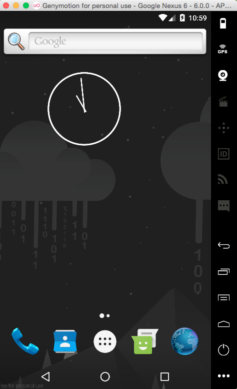
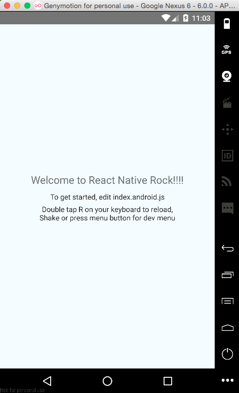
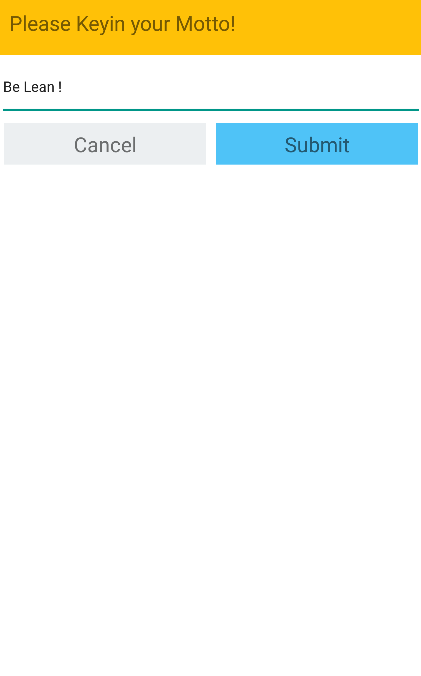
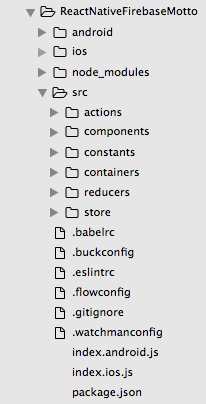
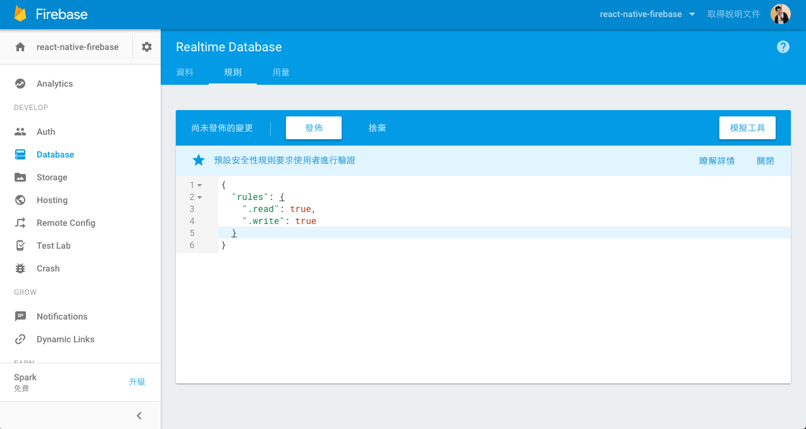
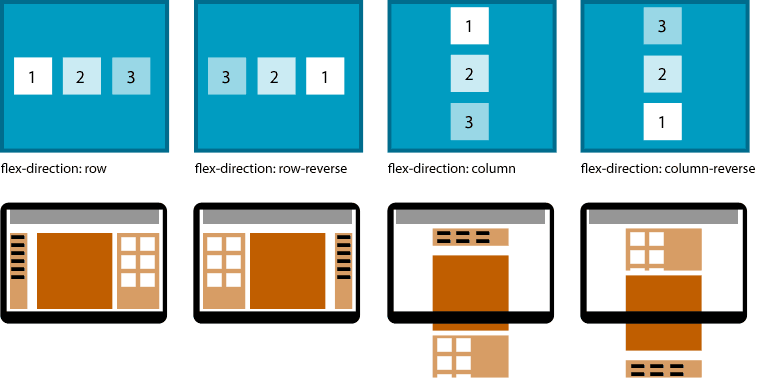
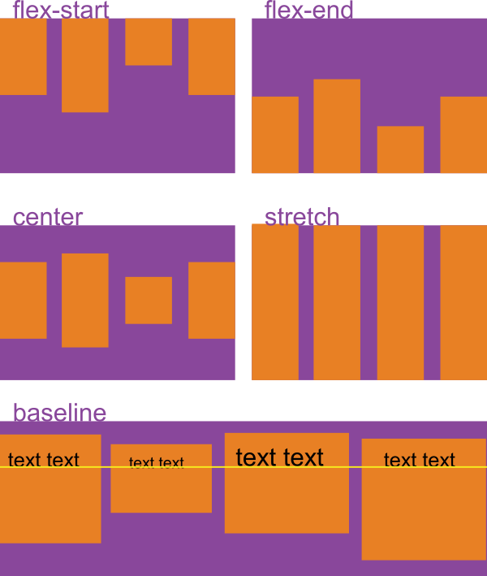

# 附錄二、用 React Native + Firebase 開發跨平台行動應用程式


## 前言
跨平台（`Wirte once, Run Everywhere`）一直以來是軟體工程的聖杯。過去一段時間市場上有許多嘗試跨平台開發原生行動裝置（Native Mobile App）的解決方案，嘗試運用 HTML、CSS　和 JavaScript 等網頁前端技術達到跨平台的效果，例如：運用 [jQuery Mobile](https://jquerymobile.com/)、[Ionic](http://ionicframework.com/) 和 [Framework7](http://framework7.io/) 等 Mobile UI 框架（Framework）結合 JavaScript 框架並搭配 [Cordova/PhoneGap](https://en.wikipedia.org/wiki/Apache_Cordova) 進行跨平台行動裝置開發。然而，因為這些解決方案通常都是運行在 `WebView` 之上，導致效能和體驗要真正趨近於原生應用程式（Native App）還有一段路要走。

不過，隨著 Facebook 工程團隊開發的 [React Native](https://facebook.github.io/react-native/) 橫空出世，想嘗試跨平台解決方案的開發者又有了新的選擇。

## React Native 特色
在正式開始開發 React Native App 之前我們先來介紹一下 React Native 的主要特色：

1. 使用 JavaScript（ES6+）和 [React](https://facebook.github.io/react/) 打造跨平台原生應用程式（Learn once, write anywhere）
2. 使用 Native Components，更貼近原生使用者體驗
3. 在 JavaScript 和 Native 之間的操作為非同步（Asynchronous）執行，並可用 Chrome 開發者工具除錯，支援 `Hot Reloading`
4. 使用 [Flexbox](https://developer.mozilla.org/en-US/docs/Web/CSS/CSS_Flexible_Box_Layout/Using_CSS_flexible_boxes) 進行排版和布局
5. 良好的可擴展性（Extensibility），容易整合 Web 生態系標準（XMLHttpRequest、 navigator.geolocation 等）或是原生的元件或函式庫（Objective-C、Java 或 Swift）  
6. Facebook 已使用 React Native 於自家 Production App 且將持續維護，另外也有持續蓬勃發展的技術社群
7. 讓 Web 開發者可以使用熟悉的技術切入 Native App 開發
8. 2015/3 釋出 iOS 版本，2015/9 釋出 Android 版本
9. 目前更新速度快，平均每兩週發佈新的版本。社群也還持續在尋找最佳實踐，關於版本進展可以[參考這個文件](https://facebook.github.io/react-native/versions.html)
10. 支援的作業系統為 >= Android 4.1 (API 16) 和 >= iOS 7.0

## React Native 初體驗
在了解了 React Native 特色後，我們準備開始開發我們的 React Native 應用程式！由於我們的範例可以讓程式跨平台共用，所以你可以使用 iOS 和 Android 平台運行。不過若是想在 iOS 平台開發需要先準備 Mac OS 和安裝 [Xcode](https://developer.apple.com/xcode/) 開發工具，若是你準備使用 Android 平台的話建議先行安裝 [Android Studio](https://developer.android.com/studio/index.html) 和 [Genymotion 模擬器](https://www.genymotion.com/)。在我們範例我們使用筆者使用的 MacO OS 作業系統並使用 Android 平台為主要範例，若有其他作業系統需求的讀者可以參考 [官方安裝說明](https://facebook.github.io/react-native/docs/getting-started.html)。

一開始請先安裝 [Node](https://nodejs.org/en/)、[Watchman](https://facebook.github.io/watchman/)。

```
// 若你使用 Mac OS 你可以使用官網安裝方式或是使用 brew 安裝
brew install node
// 可以監看檔案是否有修改
brew install watchman
```

```
// React Native command line 工具
npm install -g react-native-cli
```

現在，我們先透過一個簡單的 `HelloWorldApp`，讓大家感受一下 React Native 專案如何開發。

首先，我們先 init 一個 React Native Project：

```
react-native init HelloWorldApp
```

初始的資料夾結構長相：


接下來請先安裝註冊 [Genymotion](https://www.genymotion.com/)，Genymotion 是一個透過電腦模擬 Android 系統的好用開發模擬器環境。安裝完後可以打開並選擇欲使用的螢幕大小和 API 版本的 Android 系統。建立裝置後就可以啟動我們的裝置：



若你是使用 Mac OS 作業系統的話可以執行 `run-ios`，若是使用 Android 平台則使用 `run-android`，在這邊我們先使用 Android 平台進行開發：

```
$ react-native run-android
```

如果一切順利的話就可以在模擬器中看到初始畫面：


接著打開 `index.android.js` 就可以看到以下程式碼：
```javascript
import React, { Component } from 'react';
import {
  AppRegistry,
  StyleSheet,
  Text,
  View
} from 'react-native';

// 元件式的開發方式和 React 如出一轍，但要注意的是在 React Native 中我們不使用 HTML 元素而是使用 React Native 元件進行開發，這也符合 Learn once, write anywhere 的原則。
class HelloWorldApp extends Component {
  render() {
    return (
      <View style={styles.container}>
        <Text style={styles.welcome}>
          Welcome to React Native!
        </Text>
        <Text style={styles.instructions}>
          To get started, edit index.android.js
        </Text>
        <Text style={styles.instructions}>
          Double tap R on your keyboard to reload,{'\n'}
          Shake or press menu button for dev menu
        </Text>
      </View>
    );
  }
}

// 在 React Native 中 styles 是使用 JavaScript 形式來撰寫，與一般 CSS 比較不同的是他使用駝峰式的屬性命名：
const styles = StyleSheet.create({
  container: {
    flex: 1,
    justifyContent: 'center',
    alignItems: 'center',
    backgroundColor: '#F5FCFF',
  },
  welcome: {
    fontSize: 20,
    textAlign: 'center',
    margin: 10,
  },
  instructions: {
    textAlign: 'center',
    color: '#333333',
    marginBottom: 5,
  },
});

// 告訴 React Native App 你的進入點：
AppRegistry.registerComponent('HelloWorldApp', () => HelloWorldApp);
```

由於 React Native 有支援 `Hot Reloading`，若我們更改了檔案內容，我們可以使用打開模擬器 Menu 重新刷新頁面，此時就可以在看到原本的 `Welcome to React Native!` 文字已經改成 `Welcome to React Native Rock!!!! `




嗯，有沒有感覺在開發網頁的感覺？

## 動手實作
相信看到這裡讀者們一定等不及想大展身手，使用 React Native 開發你第一個 App。俗話說學習一項新技術最好的方式就是做一個 TodoApp。所以，接下來的文章，筆者將帶大家使用 React Native 結合 Redux/ImmutableJS 和 Firebase 開發一個記錄和刪除名言佳句（Mottos）的 Mobile App！

### 專案成果截圖




### 環境安裝與設定

相關套件安裝：

```
$ npm install --save redux react-redux immutable redux-immutable redux-actions uuid firebase
```

```
$ npm install --save-dev babel-core babel-eslint babel-loader babel-preset-es2015 babel-preset-react babel-preset-react-native eslint-plugin-react-native  eslint eslint-config-airbnb eslint-loader eslint-plugin-import eslint-plugin-jsx-a11y eslint-plugin-react redux-logger
```

安裝完相關工具後我們可以初始化我們專案：

```
// 注意專案不能使用 - 或 _ 命名
$ react-native init ReactNativeFirebaseMotto
$ cd ReactNativeFirebaseMotto
```

我們先準備一下我們資料夾架構，將它設計成：



### Firebase 簡介與設定
在這個專案中我們會使用到 [Firebase](https://firebase.google.com/) 這個 `Back-End as Service`的服務，也就是說我們不用自己建立後端程式資料庫，只要使用 Firebase 所提供的 API 就好像有了一個 NoSQL 資料庫一樣，當然 Firebase 不單只有提供資料儲存的功能，但限於篇幅我們這邊將只介紹資料儲存的功能。 

1. 首先我們進到 Firebase 首頁
  

2. 登入後點選建立專案，依照自己想取的專案名稱命名

  

3. 選擇將 Firebase 加入你的網路應用程式的按鈕可以取得 App ID 的 config 資料，待會我們將會使用到

  

4. 點選左邊選單中的 Database 並點選 Realtime Database Tab 中的規則

  

  設定改為，在範例中為求簡單，我們先不用驗證方式即可操作：

  ```javascript
  {
    "rules": {
      ".read": true,
      ".write": true
    }
  }
  ```

Firebase 在使用上有許多優點，其中一個使用 Back-End As Service 的好處是你可以專注在應用程式的開發便免花過多時間處理後端基礎建設的部份，更可以讓 Back-End 共用在不同的 client side 中。此外 Firebase 在和 React 整合上也十分容易，你可以想成 Firebase 負責資料的儲存，透過 API 和 React 元件互動，Redux 負責接收管理 client state，若是監聽到 Firebase 後端資料更新後同步更新 state 並重新 render 頁面。

### 使用 Flexbox 進行 UI 布局設計 
在 React Native 中是使用 `Flexbox` 進行排版，若讀者對於 Flexbox 尚不熟悉，建議可以[參考這篇文章](https://css-tricks.com/snippets/css/a-guide-to-flexbox/)，若有需要遊戲化的學習工具，也非常推薦這兩個教學小遊戲：[FlexDefense](http://www.flexboxdefense.com/)、[FLEXBOX FROGGY](http://flexboxfroggy.com/)。

事實上我們可以將 Flexbox 視為一個箱子，最外層是 `flex containers`、內層包的是 `flex items`，在屬性上也有分是針對`flex containers` 還是真正是 `flex items` 設計的。由左而右 `main axis`，而上到下是 `cross axis`。


在 Flexbox 有許多屬性值，其中最重要的當數 `justifyContent` 和 `alignItems` 以及 `flexDirection`（注意 React Native Style 都是駝峰式寫法），所以我們這邊主要介紹這三個屬性。

Flex Direction 負責決定整個 `flex containers` 的方向，預設為 `row` 也可以改為 `column` 、 `row-reverse` 和 `column-reverse`：



Justify Content 負責決定整個 `flex containers` 內的 items 的水平擺設：


Align Items 負責決定整個 `flex containers` 內的 items 的垂直擺設：



## 動手實作
有了前面的準備，現在我們終於要開始進入核心的應用程式開發了！

```
/**
 * Sample React Native App
 * https://github.com/facebook/react-native
 * @flow
 */

import React, { Component } from 'react';
import {
  AppRegistry,
  StyleSheet,
  Text,
  View
} from 'react-native';
import Main from './src/components/Main';

class ReactNativeFirebaseMotto extends Component {
  render() {
    return (
      <Main />
    );
  }
}

AppRegistry.registerComponent('ReactNativeFirebaseMotto', () => ReactNativeFirebaseMotto);
```

```
import React from 'react';
import ReactNative from 'react-native';
import { Provider } from 'react-redux'; 
import ToolBar from '../ToolBar';
import MottoListContainer from '../../containers/MottoListContainer';
import ActionButtonContainer from '../../containers/ActionButtonContainer';
import InputModalContainer from '../../containers/InputModalContainer';
import ListItem from '../ListItem';
import * as firebase from 'firebase';
import { firebaseConfig } from '../../constants/config';
import store from '../../store';
import styles from './mainStyles';
const { View, Text } = ReactNative;

// Initialize Firebase
const firebaseApp = firebase.initializeApp(firebaseConfig);
// Create a reference with .ref() instead of new Firebase(url)
const rootRef = firebaseApp.database().ref();
const itemsRef = rootRef.child('items');

const Main = () => (
  <Provider store={store}>
    <View style={{flex: 1}}>
      <ToolBar style={styles.toolBar} />
      <MottoListContainer itemsRef={itemsRef} />
      <ActionButtonContainer />
      <InputModalContainer itemsRef={itemsRef} />
    </View>
  </Provider>
);

export default Main; 
```

```
import { StyleSheet } from 'react-native';

export default StyleSheet.create({
  toolBar: {
    flex: 1,
    flexDirection: 'column',
    backgroundColor: 'red',
  },
  listView: {
    flex: 5,
    flexDirection: 'row',    
    backgroundColor: 'red',
  },
  actionBar: {
    flex: 1,
    flexDirection: 'column',    
  }
});
```

```
import React from 'react';
import ReactNative from 'react-native';
import styles from './toolBarStyles';
const { View, Text } = ReactNative;

const ToolBar = () => (
  <View style={styles.toolBarContainer}>
    <Text style={styles.toolBarText}>Startup Mottos</Text>
  </View>
);

export default ToolBar; 
```

```
import { StyleSheet } from 'react-native';

export default StyleSheet.create({
  toolBarContainer: {
    height: 40,
    justifyContent: 'center',
    alignItems: 'center',
    flexDirection: 'column',
    backgroundColor: '#ffeb3b',
  },
  toolBarText: {
    fontSize: 20,
    color: '#212121'
  }
});
```

```
import React, { Component } from 'react';
import ReactNative from 'react-native';
import Immutable from 'immutable';
import ListItem from '../ListItem';
import styles from './mottoStyles';
const { View, Text, ListView } = ReactNative;

class MottoList extends Component {
  constructor(props) {
    super(props);
    this.renderListItem = this.renderListItem.bind(this);
    this.listenForItems = this.listenForItems.bind(this);
    this.ds = new ListView.DataSource({
      rowHasChanged: (r1, r2) => !Immutable.is(r1.get('id'), r2.get('id')),
    })
  }
  renderListItem(item) {
    return (
      <ListItem item={item} onDeleteMotto={this.props.onDeleteMotto} itemsRef={this.props.itemsRef} />
    );
  }  
  listenForItems(itemsRef) {
    itemsRef.on('value', (snap) => {
      console.log(snap.val());
      if(snap.val() === null) {
        this.props.onGetMottos(Immutable.fromJS([]));
      } else {
        this.props.onGetMottos(Immutable.fromJS(snap.val()));  
      }     
    });
  }
  componentDidMount() {
    this.listenForItems(this.props.itemsRef);
  }
  render() {
    return (
      <View>
        <ListView
          style={styles.listView}
          dataSource={this.ds.cloneWithRows(this.props.mottos.toArray())}
          renderRow={this.renderListItem}
          enableEmptySections={true}
        />
      </View>
    );
  }
}

export default MottoList;
```

```
import { StyleSheet, Dimensions } from 'react-native';
const { height } = Dimensions.get('window');
export default StyleSheet.create({
  listView: {
    flex: 1,
    flexDirection: 'column',
    height: height - 105,
  },
});
```

```
import React from 'react';
import ReactNative from 'react-native';
import styles from './listItemStyles';
const { View, Text, TouchableHighlight } = ReactNative;

const ListItem = (props) => {
  return (
    <View style={styles.listItemContainer}>
      <Text style={styles.listItemText}>{props.item.get('text')}</Text>
      <TouchableHighlight onPress={props.onDeleteMotto(props.item.get('id'), props.itemsRef)}>
        <Text>Delete</Text>
      </TouchableHighlight>
    </View>
  )
};

export default ListItem;
```

```
import { StyleSheet } from 'react-native';

export default StyleSheet.create({
  listItemContainer: {
    flex: 1,
    flexDirection: 'row',
    padding: 10,
    margin: 5,
  },
  listItemText: {
    flex: 10,
    fontSize: 18,
    color: '#212121',
  }
});
```

```
import React from 'react';
import ReactNative from 'react-native';
import styles from './inputModelStyles';
const { View, Text, Modal, TextInput, TouchableHighlight } = ReactNative;
const InputModal = (props) => (
  <View>
    <Modal
      animationType={"slide"}
      transparent={false}
      visible={props.isModalVisible}
      onRequestClose={props.onToggleModal}
      >
     <View>
      <View>
        <Text style={styles.modalHeader}>Please Keyin your Motto!</Text>
        <TextInput
          onChangeText={props.onChangeMottoText}
        />
        <View style={styles.buttonContainer}>      
          <TouchableHighlight 
            onPress={props.onToggleModal}
            style={[styles.cancelButton]}
          >
            <Text
              style={styles.buttonText}
            >
              Cancel
            </Text>
          </TouchableHighlight>
          <TouchableHighlight 
            onPress={props.onCreateMotto(props.itemsRef)}
            style={[styles.submitButton]}
          >
            <Text
              style={styles.buttonText}
            >
              Submit
            </Text>
          </TouchableHighlight>  
        </View>
      </View>
     </View>
    </Modal>
  </View>
);

export default InputModal;
```

```
import { StyleSheet } from 'react-native';

export default StyleSheet.create({
  modalHeader: {
    flex: 1,
    height: 30,
    padding: 10,
    flexDirection: 'row',
    backgroundColor: '#ffc107',
    fontSize: 20,
  },
  buttonContainer: {
    flex: 1,
    flexDirection: 'row',
  },
  button: {
    borderRadius: 5,
  },
  cancelButton: {
    flex: 1,
    height: 40,
    alignItems: 'center',
    justifyContent: 'center',
    backgroundColor: '#eceff1',
    margin: 5,
  },
  submitButton: {
    flex: 1,
    height: 40,
    alignItems: 'center',
    justifyContent: 'center',
    backgroundColor: '#4fc3f7',
    margin: 5,
  },
  buttonText: {
    fontSize: 20,
  }
});
```

```
import React from 'react';
import ReactNative from 'react-native';
import styles from './actionButtonStyles';
const { View, Text, Modal, TextInput, TouchableHighlight } = ReactNative;  

const ActionButton = (props) => (
  <TouchableHighlight onPress={props.onToggleModal}>
    <View style={styles.buttonContainer}>
        <Text style={styles.buttonText}>Add Motto</Text>
    </View>
  </TouchableHighlight>
);

export default ActionButton;
```

```
import { StyleSheet } from 'react-native';

export default StyleSheet.create({
  buttonContainer: {
    height: 40,
    justifyContent: 'center',
    alignItems: 'center',
    flexDirection: 'column',
    backgroundColor: '#66bb6a',
  },
  buttonText: {
    fontSize: 20,
    color: '#e8f5e9'
  }
});
```

```
import { connect } from 'react-redux';
import ActionButton from '../../components/ActionButton';
import {
  toggleModal,
} from '../../actions';
 
export default connect(
  (state) => ({}),
  (dispatch) => ({
    onToggleModal: () => (
      dispatch(toggleModal())
    )
  })
)(ActionButton);
```

```
import { connect } from 'react-redux';
import InputModal from '../../components/InputModal';
import Immutable from 'immutable';

import {
  toggleModal,
  setInMotto,
  createMotto,
} from '../../actions';
import uuid from 'uuid';
 
export default connect(
  (state) => ({
    isModalVisible: state.getIn(['ui', 'isModalVisible']),
    motto: state.getIn(['motto', 'motto']),
  }),
  (dispatch) => ({
    onToggleModal: () => (
      dispatch(toggleModal())
    ),
    onChangeMottoText: (text) => (
      dispatch(setInMotto({ path: ['motto', 'text'], value: text }))
    ),
    onCreateMotto: (motto) => (itemsRef) => () => {
      itemsRef.push({ id: uuid.v4(), text: motto.get('text'), updatedAt: Date.now() });
      dispatch(setInMotto({ path: ['motto'], value: Immutable.fromJS({ id: '', text: '', updatedAt: '' })}));
      dispatch(toggleModal());
    }
  }),
  (stateToProps, dispatchToProps, ownProps) => {
    const { motto } = stateToProps;
    const { onCreateMotto } = dispatchToProps;
    return Object.assign({}, stateToProps, dispatchToProps, ownProps, {
      onCreateMotto: onCreateMotto(motto),
    });
  },
)(InputModal);
```

```
import { connect } from 'react-redux';
import MottoList from '../../components/MottoList';
import Immutable from 'immutable';
import uuid from 'uuid';

import {
  createMotto,
  getMottos,
  changeMottoTitle,
} from '../../actions';

export default connect(
  (state) => ({
    mottos: state.getIn(['motto', 'mottos']),
  }),
  (dispatch) => ({
    onCreateMotto: () => (
      dispatch(createMotto())
    ),
    onGetMottos: (mottos) => (
      dispatch(getMottos({ mottos }))
    ),
    onChangeMottoTitle: (title) => (
      dispatch(changeMottoTitle({ value: title }))
    ),
    onDeleteMotto: (mottos) => (id, itemsRef) => () => {
      mottos.forEach((value, key) => {
        if(value.get('id') === id) {
          itemsRef.child(key).remove();
        }
      });
    }
  }),
  (stateToProps, dispatchToProps, ownProps) => {
    const { mottos } = stateToProps;
    const { onDeleteMotto } = dispatchToProps;
    return Object.assign({}, stateToProps, dispatchToProps, ownProps, {
      onDeleteMotto: onDeleteMotto(mottos),
    });
  }
)(MottoList);
```

```
import { handleActions } from 'redux-actions';
import { 
  MottoState
} from '../../constants/models';

import {
  GET_MOTTOS,
  CREATE_MOTTO,
  SET_IN_MOTTO,
} from '../../constants/actionTypes';

const mottoReducers = handleActions({
  GET_MOTTOS: (state, { payload }) => (
    state.set(
      'mottos',
      payload.mottos
    )
  ),  
  CREATE_MOTTO: (state) => (
    state.set(
      'mottos',
      state.get('mottos').push(state.get('motto'))
    )
  ),
  SET_IN_MOTTO: (state, { payload }) => (
    state.setIn(
      payload.path,
      payload.value
    )
  )
}, MottoState);

export default mottoReducers;
```

```
import { combineReducers } from 'redux-immutable';
import ui from './ui/uiReducers';
import motto from './data/mottoReducers';

const rootReducer = combineReducers({
  ui,
  motto,
});

export default rootReducer;
```

```
import { handleActions } from 'redux-actions';
import { 
  UiState,
} from '../../constants/models';

import {
  TOGGLE_MODAL,
} from '../../constants/actionTypes';

const uiReducers = handleActions({
  TOGGLE_MODAL: (state) => (
    state.set(
      'isModalVisible',
      !state.get('isModalVisible')
    )
  ),  
}, UiState);

export default uiReducers;
```

```
import { createAction } from 'redux-actions';
import {
  GET_MOTTOS,
  CREATE_MOTTO,
  SET_IN_MOTTO,
} from '../constants/actionTypes';

export const getMottos = createAction('GET_MOTTOS');
export const createMotto = createAction('CREATE_MOTTO');
export const setInMotto = createAction('SET_IN_MOTTO');
```

```
import { createAction } from 'redux-actions';
import {
  TOGGLE_MODAL,
} from '../constants/actionTypes';

export const toggleModal = createAction('TOGGLE_MODAL');
```

```
export * from './uiActions';
export * from './mottoActions';
```

```
import { createStore, applyMiddleware } from 'redux';
import createLogger from 'redux-logger';
import Immutable from 'immutable';
import rootReducer from '../reducers';

const initialState = Immutable.Map();

export default createStore(
  rootReducer,
  initialState,
  applyMiddleware(createLogger({ stateTransformer: state => state.toJS() }))
);
```

```
export const GET_MOTTOS = 'GET_MOTTOS';
export const CREATE_MOTTO = 'CREATE_MOTTO';
export const SET_IN_MOTTO = 'SET_IN_MOTTO';
export const TOGGLE_MODAL = 'TOGGLE_MODAL';
```

```
export const firebaseConfig = {
  apiKey: "apiKey",
  authDomain: "authDomain",
  databaseURL: "databaseURL",
  storageBucket: "storageBucket",
};
```

```
import Immutable from 'immutable';

export const MottoState = Immutable.fromJS({
  mottos: [],
  motto: {
    id : '',
    text: '',
    updatedAt: '',
  }
});

export const UiState = Immutable.fromJS({
  isModalVisible: false,
});
```

當呼叫 Firebase API 進行資料更動時，Firebase Realtime Database 就會即時更新：


```
$ react-native run-android
```


## 總結
恭喜你！你已經完成了你的第一個 React Native App，若你希望將你開發的應用程式上架，請參考官方的說明文件。

## 延伸閱讀
1. [React Native 官方網站](https://facebook.github.io/react-native/)
2. [React 官方網站](https://facebook.github.io/react/)
3. [Redux 官方文件](http://redux.js.org/index.html)
4. [Ionic Framework vs React Native](https://medium.com/react-id/ionic-framework-hybrid-app-vs-react-native-4facdd93f690#.eh74uqqlk)
5. [How to Build a Todo App Using React, Redux, and Immutable.js](https://www.sitepoint.com/how-to-build-a-todo-app-using-react-redux-and-immutable-js/)
6. [Your First Immutable React & Redux App](https://reactjsnews.com/your-first-redux-app)
7. [React, Redux and Immutable.js: Ingredients for Efficient Web Applications](https://www.toptal.com/react/react-redux-and-immutablejs)
8. [Full-Stack Redux Tutorial](http://teropa.info/blog/2015/09/10/full-stack-redux-tutorial.html)
9. [redux与immutable实例](http://react-china.org/t/redux-immutable/2431)
10. [gajus/redux-immutable](https://github.com/gajus/redux-immutable)
11. [acdlite/redux-actions](https://github.com/acdlite/redux-actions)
12. [Flux Standard Action](https://github.com/acdlite/flux-standard-action)
13. [React Native ImmutableJS ListView Example](https://medium.com/front-end-hacking/react-native-immutable-listview-example-78662fa64a15#.1b3jtjghp)
14. [React Native 0.23.1 warning: 'In next release empty section headers will be rendered'](https://github.com/FaridSafi/react-native-gifted-listview/issues/39)
15. [js.coach](https://js.coach/)
16. [React Native Package Manager](https://github.com/rnpm/rnpm)
17. [React Native 学习笔记](https://github.com/crazycodeboy/RNStudyNotes)
18. [The beginners guide to React Native and Firebase](https://firebase.googleblog.com/2016/01/the-beginners-guide-to-react-native-and_84.html)
19. [Authentication in React Native with Firebase](https://www.sitepoint.com/authentication-in-react-native-with-firebase/)
20. [bruz/react-native-redux-groceries](https://github.com/bruz/react-native-redux-groceries)
21. [Building a Simple ToDo App With React Native and Firebase](https://devdactic.com/react-native-firebase-todo/)
22. [Firebase Permission Denied](http://stackoverflow.com/questions/37403747/firebase-permission-denied)
23. [Best Practices: Arrays in Firebase](https://firebase.googleblog.com/2014/04/best-practices-arrays-in-firebase.html)

(image via [moduscreate](http://moduscreate.com/wp-content/uploads/2015/07/ReactNativelogo.png)、[css-tricks](https://cdn.css-tricks.com/wp-content/uploads/2011/08/flexbox.png)、[teamtreehouse](http://blog.teamtreehouse.com/wp-content/uploads/2012/12/flexbox-justify.png)、[teamtreehouse](http://blog.teamtreehouse.com/wp-content/uploads/2012/12/flexbox-flex-direction.png)、[css-tricks](https://css-tricks.com/wp-content/uploads/2014/05/align-items.svg)、[css-tricks](https://css-tricks.com/wp-content/uploads/2013/04/justify-content.svg))
