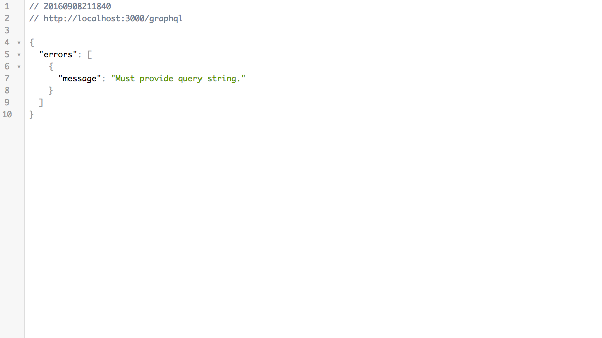
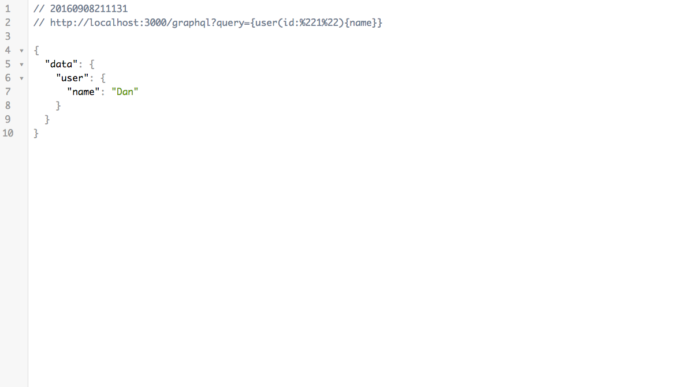
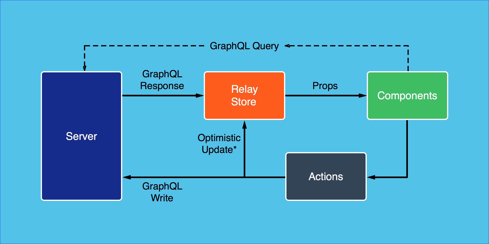

# 附录四、GraphQL/Relay 初体验


## 前言
GraphQL 的出现主要是为了要解决 Web/Mobile 端不断增加的 API 请求所衍生的问题。由于 RESTful 最大的功能在于很有效的前后端分离和建立 stateless 请求，然而 RESTful API 的资源设计上比较偏向单方面的互动，若是有著复杂资源间的关联就会出现请求次数过多，遇到不少的瓶颈。

## GraphQL 初体验

>GraphQL is a data query language and runtime designed and used at Facebook to request and deliver data to mobile and web apps since 2012.

根据 [GraphQL 官方网站](http://graphql.org/)的定义，GraphQL 是一个数据查询语言和 runtime。Query responses 是由 client 所定义决定，而非 server 端，且只会回传 client 所定义的内容。此外，GraphQL 是强型别（strong type）且可以容易使用阶层（hierarchical）和处理复杂的数据关连性，并更容易让前端工程师和产品工程师定义 Schema 来使用，赋予前端对于数据的制定能力。

GraphQL 主要由以下组件构成：

1. 类型系统（Type System）
2. 查询语言（Query Language）：在 Operations 中 query 只读取数据而 mutation 写入操作
3. 执行语句（Execution Semantics）
4. 静态验证（Static Validation）
5. 类型检查（Type Introspection）

一般 RESTful 在取用资源时会对应到 HTTP 中 `GET`、`POST`、`DELETE`、`PUT` 等方法，并以 URL 对应的方式去取得资源，例如：

取得 id 为 3500401 的使用者数据：

GET `/users/3500401`

以下则是 GraphQL 定义的 query 范例，定义式（declarative）的方式比起 RESTful 感觉起来相对直观：

```javascript
{
  user(id: 3500401) {
    id,
    name,
    isViewerFriend,
    profilePicture(size: 50)  {
      uri,
      width,
      height
    }
  }
}
```

接收到 GraphQL query 后 server 回传结果：

```javascript
{
  "user" : {
    "id": 3500401,
    "name": "Jing Chen",
    "isViewerFriend": true,
    "profilePicture": {
      "uri": "http://someurl.cdn/pic.jpg",
      "width": 50,
      "height": 50
    }
  }
}
```

### 实战演练

在 GraphQL 中有取得数据 Query、更改数据 Mutation 等操作。以下我们先介绍如何建立 GraphQL Server 并取得数据。

1. 环境配置
	接下来我们将动手建立 GraphQL 的简单范例，让大家感受一下 GraphQL 的特性，在这之前我们需要先安装以下包并搭建好环境：

	1. [graphql](https://github.com/graphql/graphql-js)：GraphQL 的 JavaScript 实践.
	2. [express](https://github.com/expressjs/express)：Node web framework.
	3. [express-graphql](https://github.com/graphql/express-graphql), an express middleware that exposes a GraphQL server.

	```
	$ npm init
	$ npm install graphql express express-graphql --save
	```

2. Data 格式设计

	以下是 `data.json`：

	```
	{
	  "1": {
	    "id": "1",
	    "name": "Dan"
	  },
	  "2": {
	    "id": "2",
	    "name": "Marie"
	  },
	  "3": {
	    "id": "3",
	    "name": "Jessie"
	  }
	}
	```

3. Server 设计

	```javascript
	// 引入函数库
	import graphql from 'graphql';
	import graphqlHTTP from 'express-graphql';
	import express from 'express';
	
	// 引入 data
	const data = require('./data.json');

	// 定义 User type 的两个子 fields：`id` 和 `name` 字串，注意型别对于 GraphQL 非常重要
	const userType = new graphql.GraphQLObjectType({
	  name: 'User',
	  fields: {
	    id: { type: graphql.GraphQLString },
	    name: { type: graphql.GraphQLString },
	  }
	});

	const schema = new graphql.GraphQLSchema({
	  query: new graphql.GraphQLObjectType({
	    name: 'Query',
	    fields: {
	      user: {
	      	// 使用上面定义的 userType
	        type: userType,
	        // 定义所接受的 user 参数
	        args: {
	          id: { type: graphql.GraphQLString }
	        },
			// 当传入参数后 resolve 如何处理回传 data
	        resolve: function (_, args) {
	          return data[args.id];
	        }
	      }
	    }
	  })
	});

	// 启动 graphql server
	express()
	  .use('/graphql', graphqlHTTP({ schema: schema, pretty: true }))
	  .listen(3000);

	console.log('GraphQL server running on http://localhost:3000/graphql');
	```

	在终端机执行：

	```
	node index.js
	```

	这个时候我们可以打开浏览器输入 ` localhost:3000/graphql.`，由于没有任何 Query，目前会出现以下画面：

	

4. Query 设计

	当 GraphQL 指令为：

	```javascript
	{
	  user(id: "1") {
	    name
	  }
	}
	```	

	将回传数据：
	
	```javascript
	{
	  "data": {
	    "user": {
	      "name": "Dan"
	    }
	  }
	}
	```

	在了解了数据和 Query 设计后，这个时候我们可以打开浏览器输入（当然也可以通过终端机 curl 的方式执行）：
	`http://localhost:3000/graphql?query={user(id:"1"){name}}`，此时 server 会根据 GET 的数据回传：

	

到这里，你已经完成了最简单的 GraphQL Server 设计了，若你遇到编码问题，可以尝试使用 JavaScript 中的 `encodeURI` 去进行转码。也可以自己尝试不同的 Schema 和 Query，感受一下 GraphQL 的特性。事实上，GraphQL 还拥有许多有趣的特色，例如：Fragment、指令、Promise 等，若读者对于 GraphQL 有兴趣可以进一步参考 [GraphQL 官网](http://graphql.org/)。

## Relay 初体验

>Relay is a new framework from Facebook that provides data-fetching functionality for React applications.

在体验完 GraphQL 后，我们要来聊聊 Relay。Relay 是 Facebook 为了满足大型应用程序开发所建构的框架，主要用于处理 React 应用层（Application）的数据互动框架。在 Relay 中可以让每个 Component 通过 GraphQL 的整合处理可以精确地向 Component props 提供取得的数据，并在 client side 存放一份所有数据的 store 当作暂存。

整个 Relay 架构流程图：



一般来说要使用 Relay 必须先准备好以下三项工具：

1. A GraphQL Schema
	- [graphql-js](https://github.com/graphql/graphql-js)
	- [graphql-relay-js](https://github.com/graphql/graphql-relay-js)

2. A GraphQL Server
	- [express](https://github.com/expressjs/express)
	- [express-graphql](https://github.com/graphql/express-graphql)

3. Relay
	- [network layer](https://github.com/facebook/relay/tree/master/src/network-layer/default)：Relay 通过 network layer 传 GraphQL 给 server

接下来我们来通过 React 官方上的范例来让大家感受一下 Relay 的特性。上面我们有提过：在 Relay 中可以让每个 Component 通过 GraphQL 的整合处理可以更精确地向 Component props 提供取得的数据，并在 client side 存放一份所有数据的 store 当作暂存。所以，首先我们先建立每个 Component 和 GraphQL/Relay 的对应：

```javascript
// 建立 Tea Component，从 this.props.tea 取得数据
class Tea extends React.Component {
  render() {
    var {name, steepingTime} = this.props.tea;
    return (
      <li key={name}>
        {name} (<em>{steepingTime} min</em>)
      </li>
    );
  }
}
// 使用 Relay.createContainer 建立数据沟通窗口 
Tea = Relay.createContainer(Tea, {
  fragments: {
    tea: () => Relay.QL`
      fragment on Tea {
        name,
        steepingTime,
      }
    `,
  },
});

class TeaStore extends React.Component {
  render() {
    return <ul>
      {this.props.store.teas.map(
        tea => <Tea tea={tea} />
      )}
    </ul>;
  }
}
TeaStore = Relay.createContainer(TeaStore, {
  fragments: {
    store: () => Relay.QL`
      fragment on Store {
        teas { ${Tea.getFragment('tea')} },
      }
    `,
  },
});

// Route 设计
class TeaHomeRoute extends Relay.Route {
  static routeName = 'Home';
  static queries = {
    store: (Component) => Relay.QL`
      query TeaStoreQuery {
        store { ${Component.getFragment('store')} },
      }
    `,
  };
}

ReactDOM.render(
  <Relay.RootContainer
    Component={TeaStore}
    route={new TeaHomeRoute()}
  />,
  mountNode
);
```

GraphQL Schema 和 store 建立：

```javascript
// 引入函数库
import {
  GraphQLInt,
  GraphQLList,
  GraphQLObjectType,
  GraphQLSchema,
  GraphQLString,
} from 'graphql';

// client side 暂存 store，GraphQL Server reponse 会更新 store，再通过 props 传递给 Component
const STORE = {
  teas: [
    {name: 'Earl Grey Blue Star', steepingTime: 5},
    {name: 'Milk Oolong', steepingTime: 3},
    {name: 'Gunpowder Golden Temple', steepingTime: 3},
    {name: 'Assam Hatimara', steepingTime: 5},
    {name: 'Bancha', steepingTime: 2},
    {name: 'Ceylon New Vithanakande', steepingTime: 5},
    {name: 'Golden Tip Yunnan', steepingTime: 5},
    {name: 'Jasmine Phoenix Pearls', steepingTime: 3},
    {name: 'Kenya Milima', steepingTime: 5},
    {name: 'Pu Erh First Grade', steepingTime: 4},
    {name: 'Sencha Makoto', steepingTime: 2},
  ],
};

// 设计 GraphQL Type
var TeaType = new GraphQLObjectType({
  name: 'Tea',
  fields: () => ({
    name: {type: GraphQLString},
    steepingTime: {type: GraphQLInt},
  }),
});

// 将 Tea 整合进来
var StoreType = new GraphQLObjectType({
  name: 'Store',
  fields: () => ({
    teas: {type: new GraphQLList(TeaType)},
  }),
});

// 输出 GraphQL Schema
export default new GraphQLSchema({
  query: new GraphQLObjectType({
    name: 'Query',
    fields: () => ({
      store: {
        type: StoreType,
        resolve: () => STORE,
      },
    }),
  }),
});
```

限于篇幅，我们只能让大家感受一下 Relay 的简单范例，若大家想进一步体验 Relay 的优势，已经帮你准备好 GraphQL Server、transpiler 的 [Relay Starter Kit](https://github.com/relayjs/relay-starter-kit) 项目会是个很好的开始。

## 总结
React 生态系中，除了前端 View 的部份有革新性的创新外，GraphQL 更是对于数据取得的全新思路。虽然 GraphQL 和 Relay 已经成为开源项目，但技术上仍持续演进，若需要在团队 production 上导入仍可以持续观察。到这边，若是一路从第一章看到这里的读者真的要给自己一个热烈掌声了，我知道对于初学者来说 React 庞大且有许多的新的观念需要消化，但如同笔者在最初时所提到的，学习 React 重要的是通过这个生态系去学习现代化网页开发的工具和方法以及思路，成为更好的开发者。根据前端摩尔定律，每半年就有一次大变革，但基本 Web 问题和观念依然不变，大家一起加油啦！若有任何问题都欢迎来信给笔者或是发 `issue`，当然 PR is welcome :) 

## 延伸阅读
1. [Your First GraphQL Server](https://medium.com/the-graphqlhub/your-first-graphql-server-3c766ab4f0a2#.7e02np1rs)
2. [搭建你的第一个 GraphQL 服务器](http://qianduan.guru/2016/01/03/Your-First-GraphQL-Server/)
3. [Learn GraphQL](https://learngraphql.com/)
4. [GraphQL vs Relay](https://kadira.io/blog/graphql/graphql-vs-relay)
5. [GraphQL 官网](http://graphql.org/)
6. [Relay 官网](https://facebook.github.io/relay/)
7. [A reference implementation of GraphQL for JavaScript](https://github.com/graphql/graphql-js)
8. [深入理解 GraphQL](http://taobaofed.org/blog/2016/03/10/graphql-in-depth/)
9. [Node.js 服务端实践之 GraphQL 初探](http://taobaofed.org/blog/2015/11/26/graphql-basics-server-implementation/)

（image via [facebook](https://facebook.github.io/react/img/blog/relay-components/relay-architecture.png)、[kadira](https://cldup.com/uhBzqnK002.png)）

## :door: 任意门
| [回首页](https://github.com/blueflylin/reactjs101) | [上一章：附录三、React 测试入门教学](https://github.com/blueflylin/reactjs101/blob/master/Appendix03/README.md) | 

| [纠正、提问或许愿](https://github.com/blueflylin/reactjs101/issues) |
