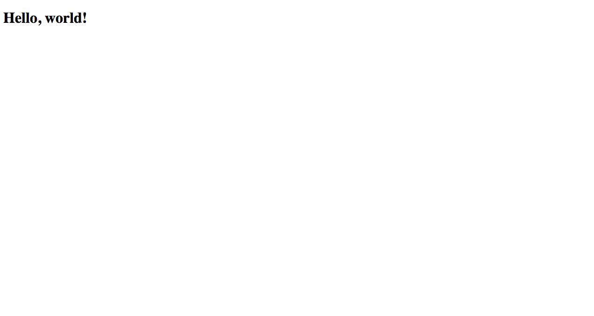
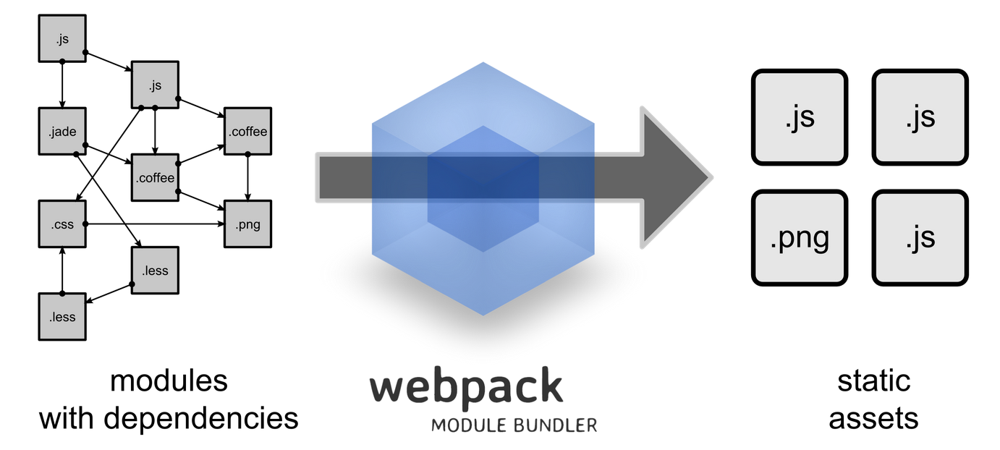

# React 開發環境設置與 Webpack 入門教學


## 前言
俗話說工欲善其事，必先利其器。寫程式也是一樣，搭建好開發環境後可以讓自己在後續開發上更加順利。因此本章接下來將討論 React 開發環境的兩種主要方式：CDN-based、 [webpack](https://webpack.github.io/)（這邊我們就先不討論 [TypeScript](https://www.typescriptlang.org/) 的開發方式）。至於 [browserify](https://webpack.github.io/) 搭配 [Gulp](http://gulpjs.com/) 的方法則會放在補充資料中，讓讀者閱讀完本章後可以開始 React 開發之旅！

## JavaScript 模組化
隨著網站開發的複雜度提昇，許多現代化的網站已不是單純的網站而已，更像是個富有互動性的網頁應用程式（Web App）。為了應付現代化網頁應用程式開發的需求，解決一些像是全域變數污染、低維護性等問題，JavaScript 在模組化上也有長足的發展。過去一段時間讀者們或許聽過像是 `Webpack`、`Browserify`、`module bundlers`、`AMD`、`CommonJS`、`UMD`、`ES6 Module` 等有關 JavaScript 模組化開發的專有名詞或工具，在前面一個章節我們也簡單介紹了關於 JavaScript 模組化的簡單觀念和規範介紹）。若是讀者對於 JavaScript 模組化開發尚不熟悉的話推薦可以參考 [這篇文章](http://huangxuan.me/2015/07/09/js-module-7day/) 和 [這篇文章](https://medium.freecodecamp.com/javascript-modules-a-beginner-s-guide-783f7d7a5fcc#.oa2n5s5zt)，當作入門。

總的來說，使用模組化開發 JavaScript 應用程式主要有以下三種好處：

1. 提昇維護性（Maintainability）
2. 命名空間（Namespacing）
3. 提供可重用性（Reusability）

而在 React 應用程式開發上更推薦使用像是 `Webpack` 這樣的 `module bundlers` 來組織我們的應用程式，但對於一般讀者來說 `Webpack` 強大而完整的功能相對複雜。為了讓讀者先熟悉 `React` 核心觀念（我們假設讀者已經有使用 `JavaScript` 或 `jQuery` 的基本經驗），我們將從使用 `CDN` 引入 `<script>` 的方式開始介紹：


使用 CDN-based 的開發方式缺點是較難維護我們的程式碼（當引入函式庫一多就會有很多 `<script/>`）且會容易遇到版本相容性問題，不太適合開發大型應用程式，但因為簡單易懂，適合教學上使用。

以下是 React [官方首頁的範例](https://facebook.github.io/react/index.html)，以下使用 `React v15.2.1`：

1. 理解 `React` 是 `Component` 導向的應用程式設計
2. 引入 `react.js`、`react-dom.js`（react 0.14 後將 react-dom 從 react 核心分離，更符合 react 跨平台抽象化的定位）以及 `babel-core-browser` 版 script（可以想成 `babel` 是翻譯機，翻譯瀏覽器看不懂的 `JSX` 或 `ES6+` 語法成為瀏覽器看的懂得的 `JavaScript`。為了提昇效率，通常我們都會在伺服器端做轉譯）
3. 在 `<body>` 撰寫 React Component 要插入（mount）指定節點的地方：`<div id="example"></div>`
4. 透過 `babel` 進行語言翻譯 `React JSX` 語法，`babel` 會將其轉為瀏覽器看的懂得 `JavaScript`。其代表意義是：`ReactDOM.render(欲 render 的 Component 或 HTML 元素, 欲插入的位置)`。所以我們可以在瀏覽器上打開我們的 `hello.html`，就可以看到 `Hello, world!` 。That's it，我們第一個 `React` 應用程式就算完成了！

```html
<!DOCTYPE html>
<html>
  <head>
    <meta charset="UTF-8" />
    <title>Hello React!</title>
    <!-- 以下引入 react.js, react-dom.js（react 0.14 後將 react-dom 從 react 核心分離，更符合 react 跨平台抽象化的定位）以及 babel-core browser 版 -->
    <script src="https://cdnjs.cloudflare.com/ajax/libs/react/15.2.1/react.min.js"></script>
    <script src="https://cdnjs.cloudflare.com/ajax/libs/react/15.2.1/react-dom.min.js"></script>
    <script src="https://cdnjs.cloudflare.com/ajax/libs/babel-core/5.8.34/browser.min.js"></script>
  </head>
  <body>
    <!-- 這邊的 id="example" 的 <div> 為 React Component 要插入的地方 -->
    <div id="example"></div>
    <!-- 以下就是包在 babel（透過進行語言翻譯）中的 React JSX 語法，babel 會將其轉為瀏覽器看的懂得 JavaScript -->
    <script type="text/babel">
      ReactDOM.render(
        <h1>Hello, world!</h1>,
        document.getElementById('example')
      );
    </script>
  </body>
</html>
```

在瀏覽器瀏覽最後成果：



## Webpack


[Webpack](https://webpack.github.io/) 是一個模組打包工具（module bundler），以下列出 Webpack 的幾項主要功能：

- 將 CSS、圖片與其他資源打包
- 打包之前預處理（Less、CoffeeScript、JSX、ES6 等）的檔案
- 依 entry 文件不同，把 .js 分拆為多個 .js 檔案
- 整合豐富的 Loader 可以使用（Webpack 本身僅能處理 JavaScript 模組，其餘檔案如：CSS、Image 需要載入不同 Loader 進行處理）

接下來我們一樣透過 Hello World 實例來介紹如何用 Webpack 設置 React 開發環境：

1. 安裝 Node 和 NPM

2. 安裝 Webpack（可以 global 或 local project 安裝）、webpack loader、webpack-dev-server

	Webpack 中的 loader 類似於 browserify 內的 transforms，但 Webpack 在使用上比較多元，除了 JavaScript loader 外也有 CSS Style 和圖片的 loader。此外，`webpack-dev-server` 則可以啟動開發用 server 方便使用

	```
	$ npm install --save-dev babel-core babel-eslint babel-loader babel-preset-es2015 babel-preset-react html-webpack-plugin webpack webpack-dev-server
	```

3. 設定 `webpack.config.js`
	事實上，`webpack.config.js` 有點類似於 `gulp` 中的 `gulpfile.js` 功用，主要是設定 `webpack` 的相關設定

	```javascript
	// 這邊使用 HtmlWebpackPlugin，將 bundle 好得 <script> 插入到 body  
	const HtmlWebpackPlugin = require('html-webpack-plugin');

	const HTMLWebpackPluginConfig = new HtmlWebpackPlugin({
	  template: `${__dirname}/app/index.html`,
	  filename: 'index.html',
	  inject: 'body',
	});
	
	// 檔案起始點從 entry 進入，也可以是多個檔案。output 是放入產生出來的結果的相關參數。loaders 則是放欲使用的 loaders，在這邊是使用 babel-loader 將所有 .js（這邊用到正則式）相關檔案轉譯成瀏覽器可以閱讀的 JavaScript。devServer 則是 webpack-dev-server 設定。plugins 放置所使用的外掛
	module.exports = {
	  entry: [
	    './app/index.js',
	  ],
	  output: {
	    path: `${__dirname}/dist`,
	    filename: 'index_bundle.js',
	  },
	  module: {
	    loaders: [
	      {
	        test: /\.js$/,
	        exclude: /node_modules/,
	        loader: 'babel-loader',
	        query: {
	          presets: ['es2015', 'react', 'stage-0'],
	        },
	      },
	    ],
	  },
	  devServer: {
	    inline: true,
	    port: 8008,
	  },
	  plugins: [HTMLWebpackPluginConfig],
	};
	```

4. 設定 `.babelrc`

	```javascript 
	{
	  "presets": [
	    "es2015",
	    "react",
	  ],
	  "plugins": []
	}
	```

5. 安裝 react 和 react-dom

	```
	$ npm install --save react react-dom
	```

6. 撰寫 Component
	`index.html`

	```html 
	<!DOCTYPE html>
	<html lang="en">
	<head>
		<meta charset="UTF-8">
		<title>React Setup</title>
		<link rel="stylesheet" type="text/css" href="//maxcdn.bootstrapcdn.com/bootstrap/3.3.6/css/bootstrap.min.css">
	</head>
	<body>
		<div id="app"></div>
	</body>
	</html>
	```

	`index.js`

	```js 
	import React from 'react';
	import ReactDOM from 'react-dom';

	class App extends React.Component {
	  constructor(props) {
	    super(props);
	    this.state = {
	    };
	  }
	  render() {
	    return (
	      <div>
	        <h1>Hello, World!</h1>
	      </div>
	    );
	  }
	}

	ReactDOM.render(<App />, document.getElementById('app'));
	```

7. 在終端機使用 `webpack`，成果展示

	- webpack：會在開發模式下開始一次性的建置
	- webpack -p：會建置 production 的程式碼 
	- webpack --watch：會監聽程式碼的修改，當儲存時有異動時會更新檔案
	- webpack -d：加入 source maps 檔案
	- webpack --progress --colors：加上處理進度與顏色

	如果不想每次都打一長串的指令碼的話可以使用 `package.json` 中的 `scripts` 設定

	```javascript 
	"scripts": {
	  "dev": "webpack-dev-server --devtool eval --progress --colors --content-base build"
	}
	```

	然後在終端機執行：

	```
	$ npm run dev
	```

當我們此時我們可以打開瀏覽器輸入 `http://localhost:8008` ，就可以看到 `Hello, world!` 了！

## 總結
以上就是 React 開發環境設置與 Webpack 入門教學。若你不想在環境設定上花太多時間的話，不妨參考 Facebook 開發社群推出的 [create-react-app](https://github.com/facebookincubator/create-react-app)，可以快速上手，使用 Webpack、[Babel](https://babeljs.io/)、[ESLint](http://eslint.org/) 開發 React 應用程式！

## 延伸閱讀
1. [JavaScript 模块化七日谈](http://huangxuan.me/2015/07/09/js-module-7day/)
2. [前端模块化开发那点历史](https://github.com/seajs/seajs/issues/588)

(image via [srinisoundar](https://cdn-images-1.medium.com/max/477/1*qhI4E_g3TDOK0uu1VAJlCQ.png)、[sitepoint](https://d2sis3lil8ndrq.cloudfront.net/screencasts/46e215cd-2eb3-4cf0-b699-713977a2b644.png)、[keyholesoftware](https://keyholesoftware.com/wp-content/uploads/Browserify-5.png)、[survivejs](http://survivejs.com/webpack/images/webpack.png))
