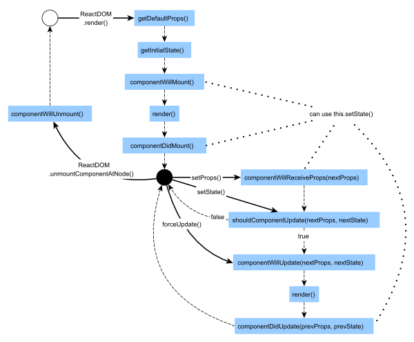

# React Component 規格與生命週期（Life Cycle）

## 前言
經過前面的努力相信目前讀者對於用 React 開發一些簡單的元件（Component）已經有一定程度的掌握了，現在我們將更細部探討 React Component 的規格和其生命週期。

## React Component 規格
若讀者還有印象的話，我們前面介紹 React 特性時有描述 React 的主要撰寫方式有兩種：一種是使用 ES6 Class，另外一種是 Stateless Components，使用 Funtional Component 的寫法，單純渲染 UI。這邊再幫大家複習一下上一個章節的簡單範例：

1. 使用 ES6 的 Class（可以進行比較複雜的操作和元件生命週期的控制，相對於 stateless components 耗費資源）

	```javascript
	//  注意元件開頭第一個字母都要大寫
	class MyComponent extends React.Component {
		// render 是 Class based 元件唯一必須的方法（method）
		render() {
			return (
				<div>Hello, {this.props.name}</div>
			);
		}
	}

	// PropTypes 驗證，若傳入的 props type 不符合將會顯示錯誤
	MyComponent.propTypes = {
		name: React.PropTypes.string,
	}

	// Prop 預設值，若對應 props 沒傳入值將會使用 default 值，為每個實例化 Component 共用的值
	MyComponent.defaultProps = {
	 	name: '', 
	}

	// 將 <MyComponent /> 元件插入 id 為 app 的 DOM 元素中
	ReactDOM.render(<MyComponent name="Mark"/>, document.getElmentById('app'));
	```

2. 使用 Funtional Component 寫法（單純地 render UI 的 stateless components，沒有內部狀態、沒有實作物件和 ref，沒有生命週期函數。若非需要控制生命週期的話建議多使用 stateless components 獲得比較好的效能）

	```javascript
	// 使用 arror function 來設計 Funtional Component 讓 UI 設計更單純（f(D) => UI），減少副作用（side effect）
	const MyComponent = (props) => (
		<div>Hello, {props.name}</div>
	);

	// PropTypes 驗證，若傳入的 props type 不符合將會顯示錯誤
	MyComponent.propTypes = {
		name: React.PropTypes.string,
	}

	// Prop 預設值，若對應 props 沒傳入值將會使用 default 值
	MyComponent.defaultProps = {
		name: '', 
	}
	
	// 將 <MyComponent /> 元件插入 id 為 app 的 DOM 元素中
	ReactDOM.render(<MyComponent name="Mark"/>, document.getElmentById('app'));
	```

值得留意的是在 ES6 Class 中 `render()` 是唯一必要的方法（但要注意的是請保持 `redner()` 的純粹，不要在裡面進行 `state` 修改或是使用非同步方法和瀏覽器互動，若需非同步互動請於 `componentDidMount()` 操作），而 Funtional Component 目前允許 `return null` 值。 喔對了，在 ES6 中也不支援 `mixins` 複用其他元件的方法了。

## React Component 生命週期
React Component，就像人會有生老病死一樣有生命週期。一般而言 Component 有以下三種生命週期的狀態：

1. Mounting：已插入真實的 DOM
2. Updating：正在被重新渲染
3. Unmounting：已移出真實的 DOM

針對 Component 的生命週期狀態 React 也有提供對應的處理方法：

1. Mounting
	- componentWillMount()
	- componentDidMount()
2. Updating
	- componentWillReceiveProps(object nextProps)：已載入元件收到新的參數時呼叫
	- shouldComponentUpdate(object nextProps, object nextState)：元件判斷是否重新渲染時呼叫，起始不會呼叫除非呼叫 forceUpdate()
	- componentWillUpdate(object nextProps, object nextState)
	- componentDidUpdate(object prevProps, object prevState)
3. Unmounting
	- componentWillUnmount()

很多讀者一開始學習 Component 生命週期時會覺得很抽象，所以接下來用一個簡單範例讓大家感受一下 Component 的生命週期。讀者可以發現當一開始載入元件時第一個會觸發 `console.log('constructor');`，依序執行 `componentWillMount`、`componentDidMount` ，而當點擊文字觸發 `handleClick()` 更新 `state` 時則會依序執行 `componentShouldUpdatte`、`componentDidUpdate`：  

HTML Markup：
```html
<!DOCTYPE html>
<html>
<head>
  <meta charset="utf-8">
  <meta name="viewport" content="width=device-width">
  <script src="https://fb.me/react-15.1.0.js"></script>
  <script src="https://fb.me/react-dom-15.1.0.js"></script>
  <title>Component LifeCycle</title>
</head>
<body>
  <div id="app"></div>
</body>
</html>
```

Component 生命週期展示：

```javascript
class MyComponent extends React.Component {
  constructor(props) {
    super(props);
    console.log('constructor');
    this.handleClick = this.handleClick.bind(this);
    this.state = {
      name: 'Mark',
    }
  }
  handleClick() {
    this.setState({'name': 'Zuck'});
  } 
  componentWillMount() {
    console.log('componentWillMount');
  }
  componentDidMount() {
    console.log('componentDidMount');    
  }
  componentWillReceiveProps() {
    console.log('componentWillReceiveProps');        
  }  
  componentShouldUpdatte() {
    console.log('componentShouldUpdatte');        
  }
  componentWillUpdate() {
    console.log('componentWillUpdate');        
  }
  componentDidUpdate() {
    console.log('componentDidUpdate');        
  }  
  componentWillUnmount() {
    console.log('componentWillUnmount');        
  }    
  render() {
    return (
      <div onClick={this.handleClick}>Hi, {this.state.name}</div>
    );
  }
}

ReactDOM.render(<MyComponent />, document.getElementById('app'));               
```

<a class="jsbin-embed" href="http://jsbin.com/yokebo/embed?html,js,console,output">點擊看詳細範例</a><script src="http://static.jsbin.com/js/embed.min.js?3.39.12"></script>



其中特殊處理的函數 `shouldComponentUpdate`，目前預設 `return true`。若你想要優化效能可以自己編寫判斷方式，若採用 `immutable` 可以使用 `nextProps === this.props` 比對是否有變動：

```javascript
shouldComponentUpdate(nextProps, nextState) {
  return nextProps.id !== this.props.id;
}
```

## Ajax 非同步處理
若有需要進行 Ajax 非同步處理，請在 `componentDidMount` 進行處理。以下透過 `jQuery` 執行 `Ajax` 取得 `Github API`　資料當做範例：

HTML Markup：

```html
<!DOCTYPE html>
<html>
<head>
  <meta charset="utf-8">
  <meta name="viewport" content="width=device-width">
  <script src="https://fb.me/react-15.1.0.js"></script>
  <script src="https://fb.me/react-dom-15.1.0.js"></script>
  <script src="https://code.jquery.com/jquery-3.1.0.js"></script>
  <title>GitHub User</title>
</head>
<body>
  <div id="app"></div>
</body>
</html>
```

app.js

```javascript
class UserGithub extends React.Component {
    constructor(props) {
        super(props);
        this.state = {
          username: '',
          githubtUrl: '',
          avatarUrl: '',
        }
    }
    componentDidMount() {
        $.get(this.props.source, (result) => {
            console.log(result);
            const data = result;
            if (data) {
              this.setState({
                    username: data.name,
                    githubtUrl: data.html_url,
                    avatarUrl: data.avatar_url
              });
            }
        });
    }
    render() {
        return (
          <div>
            <h3>{this.state.username}</h3>
            
            <a href={this.state.githubtUrl}>Github Link</a>.
          </div>
        );
    }
}

ReactDOM.render(
  <UserGithub source="https://api.github.com/users/torvalds" />,
  document.getElementById('app')
);
```

<a class="jsbin-embed" href="http://jsbin.com/kupusa/embed?html,js,output">點擊看詳細範例</a><script src="http://static.jsbin.com/js/embed.min.js?3.39.12"></script>

## 總結
以上介紹了 React Component 規格與生命週期（Life Cycle）的概念，其中生命週期的概念對於初學者來說可能會比較抽象，建議讀者跟著範例動手實作。接下來我們將更進一步介紹 `React Router` 讓讀者感受一下單頁式應用程式（single page application）的設計方式。

## 延伸閱讀
1. [Component Specs and Lifecycle](https://facebook.github.io/react/docs/component-specs.html#lifecycle-methods)

（image via [react-lifecycle](http://imgh.us/react-lifecycle.svg)）
