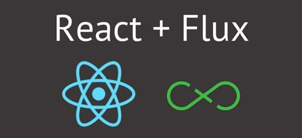
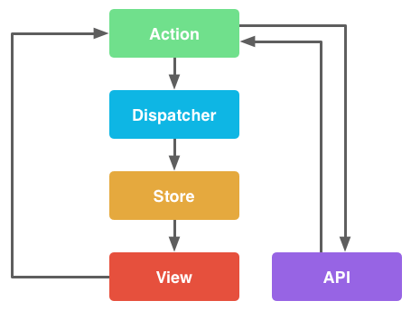
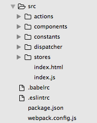
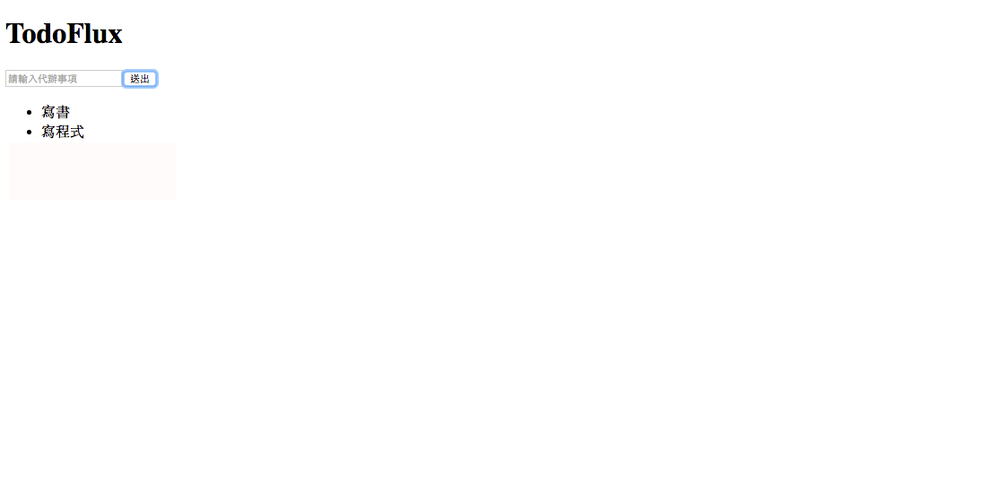

# Flux 基礎概念與實戰入門



## 前言
隨著 React App 複雜度提昇，我們會發現常常需要從 Parent Component 透過 props 傳遞方法到 Child Component 去改變 state tree，不但不方便也難以管理，因此我們需要更好的資料架構來建置更複雜的應用程式。[Flux](https://facebook.github.io/flux/) 是 Facebook 推出的 client-side 應用程式架構（Architecture），主要想解決 `MVC` 架構的一些問題。事實上，Flux 並非一個完整的前端 Framework，其特色在於實現了 Unidirectional Data Flow（單向流）的資料流設計模式，在開發複雜的大型應用程式時可以更容易地管理 state（狀態）。由於 React 主要是負責 View 的部份，所以透過搭配 Flux-like 的資料處理架構，可以更好的去管理我們的 state（狀態），處理複雜的使用者互動（例如：Facebook 同時要維護使用者是否按讚、點擊相片，是否有新訊息等狀態）。

由於原始的 Flux 架構在實現上有些部分可以精簡和改善，在實務上我們通常會使用開發者社群開發的 Flux-like 相關的架構實現（例如：[Redux](http://redux.js.org/index.html)、[Alt](http://alt.js.org/)、[Reflux](https://github.com/reflux/refluxjs) 等）。不過這邊我們主要會使用 Facebook 本身提供 `Dispatcher API` 函式庫（可以想成是一個 pub/sub 處理器，透過 broadcast 將 `payloads` 傳給註冊的 callback function）並搭配 `NodeJS` 的 `EventEmitter` 模組去完成 Flux 架構的實現。	

## Flux 概念介紹


在 Flux Unidirectional Data Flow（單項流）世界裡有四大主角，分別負責不同對應的工作：

1. actions / Action Creator 

	action 負責定義所有改變 state（狀態）的行為，可以讓開發者快速了解 App 的各種功能，若你想改變 state 你只能發 action。注意 action 可以是同步或是非同步。例如：新增代辦事項，呼叫非同步 API 獲取資料。

	實務上我們會分成 action 和 Action Creator。action 為描述行為的 object（物件），Action Creator 將 action 送給 dispatcher。一般來說符合 Flux Standard Action 的 action 會如以下範例程式碼，具備 `type` 來區別所觸發的行為。而 `payload` 則是所夾帶的資料：

	```
	// action
	const addTodo = {
	  type: 'ADD_TODO',
	  payload: {
	    text: 'Do something.'  
	  }
	}

	AppDispatcher.dispatch(addTodo);
	```

	當發生 rejected Promise 情況：

	```
	{
	  type: 'ADD_TODO',
	  payload: new Error(),
	  error: true
	}
	```

2. Dispatcher

	`Dispatcher` 是 Flux 架構的核心，每個 App 只有一個 Dispatcher，提供 API 讓 store 可以註冊 `callback function`，並負責向所有 store 發送 action 事件。在本範例中我們使用 Facebook 提供的 Dispatcher API，其內建有 `dispatch` 和 `subscribe` 方法。

3. Stores

	一個 App 通常會有多個 store 負責存放業務邏輯，根據不同業務會有不同 store，例如：TodoStore、RecipeStore。 store 負責操作和儲存資料並提供 `view` 使用 `listener`（監聽器），若有資料更新即會觸發更新。值得注意的是 store 只提供 `getter API` 讀取資料，若想改變 state 一律發送 action。

4. Views（Controller Views）

	這部份是 `React` 負責的範疇，負責提供監聽事件的 `callback function`，當事件發生時重新取得資料並重繪 `View`。

## Flux 流程回顧



Flux 架構前置作業：

1. Stores 向 Dispatcher 註冊 callback，當資料改變時告知 Stores
2. Controller Views 向 Stores 取得初始資料
3. Controller Views 將資料給 Views 去渲染 UI
4. Controller Views 向 store 註冊 listener，當資料改變時告知 Controller Views 

Flux 與使用者互動運作流程：

1. 使用者和 App 互動，觸發事件，Action Creator 發送 actions 給 Dispatcher
2. Dispatcher 依序將 action 傳給 store 並由 action type 判斷合適的處理方式
3. 若有資料更新則會觸發 Controller Views 向 store 註冊的 listener 並向 store 取得更新資料
4. View 根據 Controller Views 的新資料重新繪製 UI

## Flux 實戰初體驗
介紹完了整個 Flux 基本架構後，接下來我們就來動手實作一個簡單 Flux 架構的 Todo，讓使用者可以在 `input` 輸入代辦事項並新增。

首先，我們先完成一些開發的前置作業，先透過以下指令在根目錄產生 npm 設定檔 `package.json`：

```
$ npm init
```

安裝相關套件（包含開發環境使用的套件）：

```
$ npm install --save react react-dom flux events
```

```
$ npm install --save-dev babel-core babel-eslint babel-loader babel-preset-es2015 babel-preset-react eslint eslint-config-airbnb eslint-loader eslint-plugin-import eslint-plugin-jsx-a11y eslint-plugin-react html-webpack-plugin webpack webpack-dev-server
```

安裝好後我們可以設計一下我們的資料夾結構，首先我們在根目錄建立 `src`，放置 `script` 的 `source` 。在 `components` 資料夾中我們會放置所有 `components`（個別元件資料夾中會用 `index.js` 輸出元件，讓引入元件更簡潔），另外還有 `actions`、`constants`、`dispatcher`、`stores`，其餘設定檔則放置於根目錄下。



接下來我們參考上一章設定一下開發文檔（`.babelrc`、`.eslintrc`、`webpack.config.js`）。這樣我們就完成了開發環境的設定可以開始動手實作 `React Flux` 應用程式了！

HTML Markup：

```html
<!DOCTYPE html>
<html lang="en">
<head>
    <meta charset="UTF-8">
    <title>TodoFlux</title>
</head>
<body>
    <div id="app"></div>
</body>
</html>
```

以下為 `src/index.js` 完整程式碼，安排了父 `component` 和在 HTML Markup 插入位置：

```javascript
import React from 'react';
import ReactDOM from 'react-dom';
import TodoHeader from './components/TodoHeader';
import TodoList from './components/TodoList';

class App extends React.Component {
  constructor(props) {
    super(props);
    this.state = {};
  }
  render() {
    return (
      <div>
        <TodoHeader />
        <TodoList />
      </div>
    );
  }
}

ReactDOM.render(<App />, document.getElementById('app'));
```

通常實務上我們會開一個 `constants` 資料夾存放 `config` 或是 `actionTypes` 常數。以下是 `src/constants/actionTypes.js`：

```javascript
export const ADD_TODO = 'ADD_TODO';
```

在這個範例中我們繼承了 Facebook 提供的 Dispatcher API（主要是繼承了 `dispatch`、`register` 和 `subscribe` 的方法），打造自己的 DispatcherClass，當使用者觸發 `handleAction()` 會 `dispatch` 出事件。以下是 `src/dispatch/AppDispatcher.js`：

```javascript
// Todo app dispatcher with actions responding to both
// view and server actions
import { Dispatcher } from 'flux';

class DispatcherClass extends Dispatcher {
  handleAction(action) {
    this.dispatch({
      type: action.type,
      payload: action.payload,
    });
  }
}

const AppDispatcher = new DispatcherClass();

export default AppDispatcher;
```

以下是我們利用 `AppDispatcher` 打造的 `Action Creator` 由 `handleAction` 負責發出傳入的 `action` ，完整程式碼如 `src/actions/todoActions.js`：

```javascript
import AppDispatcher from '../dispatcher/AppDispatcher';
import { ADD_TODO } from '../constants/actionTypes';

export const TodoActions = {
  addTodo(text) {
    AppDispatcher.handleAction({
      type: ADD_TODO,
      payload: {
        text,
      },
    });
  },
};
```

`Store` 主要是負責資料以及業務邏輯處理，我們繼承了 `events` 模組的 `EventEmitter`，當 `action` 傳入 `AppDispatcher.register` 的處理範圍後，根據 `action type` 選擇適合處理的 `store` 進行處理，處理完後透過 `emit` 方法發出事件讓監聽的 `Views Controller` 知道。以下是 `src/stores/TodoStore.js`：

```javascript
import AppDispatcher from '../dispatcher/AppDispatcher';
import { ADD_TODO } from '../constants/actionTypes';
import { EventEmitter } from 'events';

const store = {
  todos: [],
  editing: false,
};

class TodoStoreClass extends EventEmitter {
  addChangeListener(callback) {
    this.on(ADD_TODO, callback);
  }
  removeChangeListener(callback) {
    this.removeListener(ADD_TODO, callback);
  }
  getTodos() {
    return store.todos;
  }
}

const TodoStore = new TodoStoreClass();

AppDispatcher.register((action) => {
  switch (action.type) {
    case ADD_TODO:
      store.todos.push(action.payload.text);
      TodoStore.emit(ADD_TODO);
      break;
    default:
      return true;
  }
  return true;
});

export default TodoStore;
```

在這個 React Flux 範例中我們把 `View` 和 `Views Controller` 整合在一起。在 `TodoHeader` 中，我們主要任務是讓使用者可以透過 `input` 新增代辦事項。使用者輸入文字在 `input` 時會觸發 `onChange` 事件，進而更新內部的 `state`，當使用者按了送出鈕就會觸發 `onAdd` 事件，`dispatch` 出 `addTodo event`。以下是 `src/components/TodoHeader.js` 完整範例：

```javascript
import React, { Component } from 'react';
import { TodoActions } from '../../actions/todoActions';

class TodoHeader extends Component {
  constructor(props) {
    super(props);
    this.onChange = this.onChange.bind(this);
    this.onAdd = this.onAdd.bind(this);
    this.state = {
      text: '',
      editing: false,
    };
  }
  onChange(event) {
    this.setState({
      text: event.target.value,
    });
  }
  onAdd() {
    TodoActions.addTodo(this.state.text);
    this.setState({
      text: '',
    });
  }
  render() {
    return (
      <div>
        <h1>TodoFlux</h1>
        <div>
          <input
            value={this.state.text}
            type="text"
            placeholder="請輸入代辦事項"
            onChange={this.onChange}
          />
          <button
            onClick={this.onAdd}
          >
            送出
          </button>
        </div>
      </div>
    );
  }
}

export default TodoHeader;
```

在上面的 Component 中我們讓使用者可以新增代辦事項，接下來我們要讓新增的代辦事項可以顯示。我們在 `componentDidMount` 設了一個監聽器 `TodoStore` 資料改變時會去把資料重新再更新，這樣當使用者新增代辦事項時 `TodoList` 就會保持同步。當以下是 `src/components/TodoList.js` 完整程式碼：

```javascript
import React, { Component } from 'react';
import TodoStore from '../../stores/TodoStore';

function getAppState() {
  return {
    todos: TodoStore.getTodos(),
  };
}
class TodoList extends Component {
  constructor(props) {
    super(props);
    this.onChange = this.onChange.bind(this);
    this.state = {
      todos: [],
    };
  }
  componentDidMount() {
    TodoStore.addChangeListener(this.onChange);
  }
  onChange() {
    this.setState(getAppState());
  }
  render() {
    return (
      <div>
        <ul>
          {
            this.state.todos.map((todo, key) => (
              <li key={key}>{todo}</li>
            ))
          }
        </ul>
      </div>
    );
  }
}

export default TodoList;
```

若讀者都有跟著上面的步驟走完的話，最後我們在終端機的根目錄位置執行 `npm start` 就可以看到整個成果囉，YA！


## 總結
Flux 優勢：

1. 讓開發者可以快速了解整個 App 中的行為
2. 資料和業務邏輯統一存放好管理
3. 讓 View 單純化只負責 UI 的排版不需負責 state 管理
4. 清楚的架構和分工對於複雜中大型應用程式易於維護和管理程式碼

Flux 劣勢：

1. 程式碼上不夠簡潔
2. 對於簡單小應用來說稍微複雜

以上就是 Flux 的實戰入門，我知道一開始接觸 Flux 的讀者一定會覺得很抽象，有些讀者甚至會覺得這個架構到底有什麼好處（明明感覺沒比 MVC 高明到哪去或是一點都不簡潔），但如同上述優點所說 Flux 設計模式的優勢在於清楚的架構和分工對於複雜中大型應用程式易於維護和管理程式碼。若還是不熟悉的讀者可以跟著範例多動手，相信慢慢就可以體會 Flux 的特色。事實上，在開發社群中為了讓 Flux 架構更加簡潔，產生了許多 Flux-like 的架構和函式庫，接下來將帶讀者們進入目前最熱門的架構：`Redux`。

## 延伸閱讀
1. [Getting To Know Flux, the React.js Architecture](https://scotch.io/tutorials/getting-to-know-flux-the-react-js-architecture)
2. [Flux 官方網站](https://facebook.github.io/flux/)
3. [從 Flux 與 MVC 的差異來簡介 Flux](http://blog.techbridge.cc/2016/04/29/introduce-flux-from-flux-and-mvc/)
4. [Flux Stores and ES6](https://medium.com/@softwarecf/flux-stores-and-es6-9b453dbf9db#.uuf1ddj8u)
5. [React and Flux: Migrating to ES6 with Babel and ESLint](https://medium.com/front-end-developers/react-and-flux-migrating-to-es6-with-babel-and-eslint-6390cf4fd878#.vafamphwy)
6. [Building an ES6/JSX/React Flux App – Part 2 – The Flux](https://shellmonger.com/2015/08/17/building-an-es6jsxreact-flux-app-part-2-the-flux/)
7. [Question: How to choose between Redux's store and React's state? #1287](https://github.com/reactjs/redux/issues/1287)
8. [acdlite/flux-standard-action](https://github.com/acdlite/flux-standard-action)

（image via [devjournal](http://devjournal.ru/wp-content/uploads/2016/03/React.js-Flux-Redux.png)、[facebook](https://facebook.github.io/flux/)、[scotch.io](https://cask.scotch.io/2014/10/V70cSEC.png)）