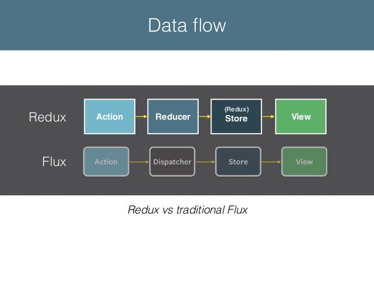
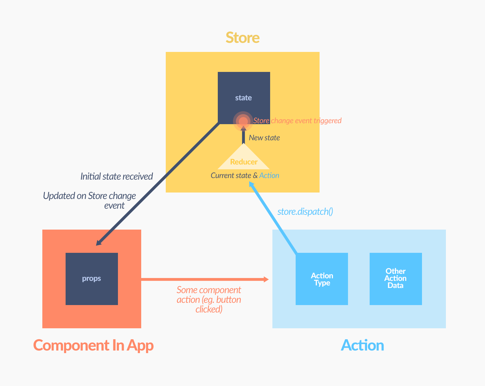

# Redux 基础概念


## 前言
前面一个章节我们讲解了 Flux 的功能和用法，但在实务上许多开发者较偏好的是同为 Flux-like 但较为简洁且文件丰富清楚的 [Redux](http://redux.js.org/index.html) 当作状态数据管理的架构。Redux 是由 Dan Abramov 所发起的一个开源的 library，其主要功能如官方首页写著：`Redux is a predictable state container for JavaScript apps.`，亦即 Redux 希望能提供一个可以预测的 state 管理容器，让开发者可以可以更容易开发复杂的 JavaScript 应用程序（注意 Redux 和 React 并无相依性，只是和 React 可以有很好的整合）。

## Flux/Redux 超级比一比

从简单 Flux/Redux 比较图可以看出两者之间有些差异：



在开始实际操作 Redux App 之前我们先来了解一下 Redux 和 Flux 的一些差异：

1. 只使用一个 store 将整个应用程序的状态 (state) 用对象树 (object tree) 的方式储存起来：

	原生的 Flux 会有许多分散的 store 储存各个不同的状态，但在 redux 中，只会有唯一一个 store 将所有的数据用对象的方式包起来。

	```javascript
	//原生 Flux 的 store
	const userStore = {
	    name: ''
	}
	const todoStore = {
	    text: ''
	}

	// Redux 的单一 store
	const state = {
	    userState: {
	        name: ''
	    },
	    todoState: {
	        text: ''
	    }
	}
	```

2. 唯一可以改变 state 的方法就是发送 action，这部份和 Flux 类似，但 Redux 并没有像 Flux 设计有 Dispatcher。Redux 的 action 和 Flux 的 action 都是一个包含 `type` 和 `payload` 的对象。

3. Redux 拥有 Flux 所没有的 Reducer。Reducer 根据 action 的 type 去执行对应的 state 做变化的函数叫做 Reducer。你可以使用 switch 或是使用函数 mapping 的方式去对应处理的方式。 

4. Redux 拥有许多方便好用的辅助测试工具（例如：[redux-devtools](https://github.com/gaearon/redux-devtools)、[react-transform-boilerplate](https://github.com/gaearon/react-transform-boilerplate)），方便测试和使用 `Hot Module Reload`。

## Redux 核心概念介绍



从上述的图中我们可以看到 Redux 数据流的模型大致上可以简化成： `View -> Action -> (Middleware) -> Reducer`。当使用者和 View 互动时会触发事件发出 Action，若有使用 Middleware 的话会在进入 Reducer 进行一些处理，当 Action 进到 Reducer 时，Reducer 会根据，action type 去 mapping 对应处理的动作，然后回传回新的 state。View 则因为侦测到 state 更新而重绘页面。在这个章节我们讨论的是 synchronous（同步）的情形，asynchronous（非同步）的状况会在接下来的章节进行讨论。以下就用官方网站上的简单范例来让大家感受一下 Redux 的整个使用流程：

```javascript
import { createStore } from 'redux';

/** 
  下面是一个简单的 reducers ，主要功能是针对传进来的 action type 判断并回传新的 state
  reducer 规格：(state, action) => newState 
  一般而言 state 可以是 primitive、array 或 object 甚至是 ImmutableJS Data。但要留意的是不能修改到原来的 state ，
  回传的是新的 state。由于使用在 Redux 中使用 ImmutableJS 有许多好处，所以我们的范例 App 也会使用 ImmutableJS 
*/
function counter(state = 0, action) {
  switch (action.type) {
  case 'INCREMENT':
    return state + 1;
  case 'DECREMENT':
    return state - 1;
  default:
    return state;
  }
}

// 创建 Redux store 去存放 App 的所有 state
// store 的可用 API { subscribe, dispatch, getState } 
let store = createStore(counter);

// 可以使用 subscribe() 来订阅 state 是否更新。但实务通常会使用 react-redux 来串连 React 和 Redux
store.subscribe(() =>
  console.log(store.getState());
);

// 若想改变 state ，一律发 action
store.dispatch({ type: 'INCREMENT' });
// 1
store.dispatch({ type: 'INCREMENT' });
// 2
store.dispatch({ type: 'DECREMENT' });
// 1
```

## Redux API 入门

1. createStore：`createStore(reducer, [preloadedState], [enhancer])`

	我们知道在 Redux 中只会有一个 store。在产生 store 时我们会使用 `createStore` 这个 API 来创建 store。第一个参数放入我们的 `reducer` 或是有多个 `reducers` combine（使用 `combineReducers`）在一起的 `rootRuducers`。第二个参数我们会放入希望预先载入的 `state` 例如：user session 等。第三个参数通常会放入我们想要使用用来增强 Redux 功能的 `middlewares`，若有多个 `middlewares` 的话，通常会使用 `applyMiddleware` 来整合。

2. Store

	属于 Store 的四个方法：

	- getState()
	- dispatch(action)
	- subscribe(listener)
	- replaceReducer(nextReducer)

	关于 Store 重点是要知道 Redux 只有一个 Sotre 负责存放整个 App 的 State，而唯一能改变 State 的方法只有发送 action。

3. combineReducers：`combineReducers(reducers)`

	combineReducers 可以将多个 reducers 进行整合并回传一个 Function，让我们可以将 reducer 适度分割

4. applyMiddleware：`applyMiddleware(...middlewares)`	

	官方针对 Middleware 进行说明
	> It provides a third-party extension point between dispatching an
	action, and the moment it reaches the reducer.
		
	若有 NodeJS 的经验的读者，对于 middleware 概念应该不陌生，让开发者可以在 req 和 res 之间进行一些操作。在 Redux 中 Middleware 则是扮演 action 到达 reducer 前的第三方扩充。而 applyMiddleware 可以将多个 `middlewares` 整合并回传一个 Function，便于使用。

	若是你要使用 asynchronous（非同步）的行为的话需要使用其中一种 middleware： [redux-thunk](https://github.com/gaearon/redux-thunk)、[redux-promise](https://github.com/acdlite/redux-promise) 或 [redux-promise-middleware](https://github.com/pburtchaell/redux-promise-middleware) ，这样可以让你在 actions 中 dispatch Promises 而非 function。asynchronous（非同步）运作方式就如同下图所示：

	

5. bindActionCreators：`bindActionCreators(actionCreators, dispatch)`

	bindActionCreators 可以将 `actionCreators` 和 `dispatch` 绑定，并回传一个 Function 或 Object，让程序更简洁。但若是使用 react-redux 可以用 `connect` 让 dispatch 行为更容易管理

6. compose：`compose(...functions)`
	
	compose 可以将 function 由右到左合并并回传一个 Function，如官网范例所示：

	```
	import { createStore, combineReducers, applyMiddleware, compose } from 'redux'
	import thunk from 'redux-thunk'
	import DevTools from './containers/DevTools'
	import reducer from '../reducers/index'

	const store = createStore(
	  reducer,
	  compose(
	    applyMiddleware(thunk),
	    DevTools.instrument()
	  )
	)
	```

## 总结
以上介绍了 Redux 的基础概念，若是读者觉得还是有点抽象的话也没关系，在下一个章节我们将实际带大家开发一个整合 `React`、`Redux` 和 `ImmutableJS` 的 TodoApp。

## 延伸阅读
1. [Redux 官方网站](http://redux.js.org/index.html)
2. [Redux架构实践——Single Source of Truth](http://react-china.org/t/redux-single-source-of-truth/5564)
3. [Presentational and Container Components](https://medium.com/@dan_abramov/smart-and-dumb-components-7ca2f9a7c7d0)
4. [使用Redux管理你的React应用](https://github.com/matthew-sun/blog/issues/18)
5. [Using redux](http://www.slideshare.net/JonasOhlsson/using-redux)

（image via [githubusercontent](https://raw.githubusercontent.com/reactjs/redux/master/logo/logo-title-dark.png)、[makeitopen](http://makeitopen.com/static/images/redux_flowchart.png)、[css-tricks](https://css-tricks.com/wp-content/uploads/2016/03/redux-article-3-03.svg)、[tighten](https://blog.tighten.co/assets/img/react-redux-diagram.png)、[tryolabs](http://blog.tryolabs.com/wp-content/uploads/2016/04/redux-simple-f8-diagram.png)、[facebook](https://facebook.github.io/flux/img/flux-simple-f8-diagram-with-client-action-1300w.png)、[JonasOhlsson](http://www.slideshare.net/JonasOhlsson/using-redux)）

## :door: 任意门
| [回首页](https://github.com/kdchang/reactjs101) | [上一章：Flux 基础概念与实战入门](https://github.com/kdchang/reactjs101/blob/master/Ch07/react-flux-introduction.md) | [下一章：Redux 实战入门](https://github.com/kdchang/reactjs101/blob/master/Ch07/react-redux-real-world-example.md) |

| [纠错、提问或许愿](https://github.com/kdchang/reactjs101/issues) |
