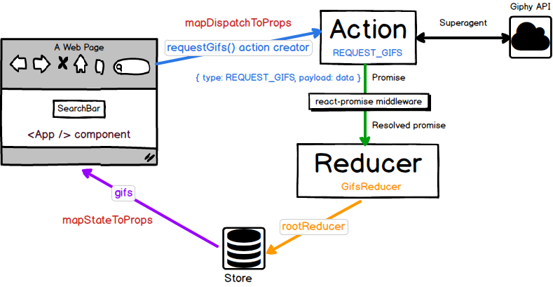

# Redux 實戰入門


## 前言
前面一個章節我們講解了 Flux 的功能和用法，但在實務上許多開發者較偏好的是同為 Flux-like 但較為簡潔的 [Redux](http://redux.js.org/index.html) 當作狀態資料管理的架構。Redux 是由 Dan Abramov 所發起的一個開源的 library，其主要功能如官方首頁寫著：`Redux is a predictable state container for JavaScript apps.`，亦即 Redux 希望能提供一個可以預測的 state 管理容器。

## Flux/Redux 超級比一比

Flux 的簡單 Flow 圖：


Redux 的簡單 Flow 圖：


在開始實作 Redux App 之前我們先來了解一下 Redux 和 Flux 的一些差異：

1. 只使用一個 store 將整個應用程式的狀態 (state) 用物件樹 (object tree) 的方式儲存起來：

	原生的 Flux 會有許多分散的 store 儲存各個不同的狀態，但在 redux 中，只會有一個 store 將所有的資料用物件的方式包起來。

	```javascript
	//原生 Flux 的 store
	const userStore = {
	    name: ''
	}
	const todoStore = {
	    text: ''
	}

	// Redux 的單一 store
	const state = {
	    userState: {
	        name: ''
	    },
	    todoState: {
	        text: ''
	    }
	}
	```

2. 唯一可以改變 state 的方法就是發送 action，這部份和 Flux 類似。Redux 的 action 和 Flux 的 action 類似，就是一個包含 `type` 和 `payload` 的物件

3. 根據 action 的 type 去執行對應的 state 做變化的函式叫做 reducer。你可以使用 switch 或是使用函式 map 的方式去對應處理的方式 

## Redux 核心概念介紹
1. Single source of truth (單一的真相來源)
2. State is read-only (狀態是唯讀的)
3. Changes are made with pure functions (使用純函式進行更改)

```javascript
import { createStore } from 'redux'

/** 
  下面是一個簡單的 reducers ，主要功能是針對傳進來的 action type 去回傳新的 state
  reducer 規格：(state, action) => state 
  一般而言 state 可以是 primitive、array 或 object 甚至是 ImmutableJS Data。但要留意的是不能修改到原來的 state ，
  回傳的是新的 state
*/
function counter(state = 0, action) {
  switch (action.type) {
  case 'INCREMENT':
    return state + 1
  case 'DECREMENT':
    return state - 1
  default:
    return state
  }
}

// 創建 Redux store 去存放 App 的所有 state，把 reducer 放入
// store 的可用 API { subscribe, dispatch, getState }.
let store = createStore(counter)

// 可以使用 subscribe() 來訂閱 state 是否更新。但實務通常會使用 react-redux 來串連 React 和 Redux

store.subscribe(() =>
  console.log(store.getState())
)

// 若想改變 state ，一律發 action
store.dispatch({ type: 'INCREMENT' })
// 1
store.dispatch({ type: 'INCREMENT' })
// 2
store.dispatch({ type: 'DECREMENT' })
// 1
```

## Redux 流程回顧

（View -> Action -> Middleware -> Reducer）



若有 NodeJS 的經驗的讀者，對於 middleware 概念應該不陌生，讓開發者可以在 req 和 res 之間進行一些操作。在 Redux 中 Middleware 則是扮演 action 到達 reducer 前的第三方擴充。


## Redux 實戰初體驗


```html
<!DOCTYPE html>
<html lang="en">
<head>
	<meta charset="UTF-8">
	<title>Redux Todo</title>
</head>
<body>
	<div id="app"></div>
</body>
</html>
```

```javascript
import React from 'react';
import ReactDOM from 'react-dom';
import { Provider } from 'react-redux';
import Main from './components/Main';
import store from './store';

ReactDOM.render(
  <Provider store={store}>
    <Main />
  </Provider>,
  document.getElementById('app')
);
```

```javascript
import { createAction } from 'redux-actions';
import {
  CREATE_TODO,
  DELETE_TODO,
  CHANGE_TEXT,
} from '../constants/actionTypes';

export const createTodo = createAction('CREATE_TODO');
export const deleteTodo = createAction('DELETE_TODO');
export const changeText = createAction('CHANGE_TEXT');
```

```javascript
export * from './todoActions';
```

```javascript
export const CREATE_TODO = 'CREATE_TODO';
export const DELETE_TODO = 'DELETE_TODO';
export const CHANGE_TEXT = 'CHANGE_TEXT';
```

```javascript
import Immutable from 'immutable';

export const TodoState = Immutable.Map({
  'todos': Immutable.List(),
  'todo': Immutable.Map({
    id: '',
    text: '',
    updatedAt: '',
    completed: false,
  })
});
```

```javascript
import { createStore, applyMiddleware } from 'redux';
import createLogger from 'redux-logger';
import Immutable from 'immutable';
import rootReducer from '../reducers';

const initialState = Immutable.Map();

export default createStore(
  rootReducer,
  initialState,
  applyMiddleware(createLogger({ stateTransformer: state => state.toJS() }))
);
```

```javascript
export { default } from './configureStore';
```

```javascript
import { handleActions } from 'redux-actions';
import { TodoState } from '../../constants/models';

import {
  CREATE_TODO,
  DELETE_TODO,
  CHANGE_TEXT,
} from '../../constants/actionTypes';

 const todoReducers = handleActions({
  CREATE_TODO: (state) => {
    let todos = state.get('todos').push(state.get('todo'));
    return state.set('todos', todos)
  },
  DELETE_TODO: (state, { payload }) => (
    state.set('todos', state.get('todos').splice(payload.index, 1))
  ),
  CHANGE_TEXT: (state, { payload }) => (
    state.merge({ 'todo': payload })
  )
}, TodoState);

export default todoReducers;
```

```javascript
import { handleActions } from 'redux-actions';
import UiState from '../../constants/models';

export default handleActions({
  SHOW: (state, { payload }) => (
    state.set('todos', payload.todo)
  ),
}, UiState); 
```

```javascript
import { combineReducers } from 'redux-immutable';
import ui from './ui/uiReducers';// import routes from './routes';
import todo from './data/todoReducers';// import routes from './routes';

const rootReducer = combineReducers({
  todo,
});

export default rootReducer;
```

```javascript
import React from 'react';
import ReactDOM from 'react-dom';
import TodoHeaderContainer from '../../containers/TodoHeaderContainer';
import TodoListContainer from '../../containers/TodoListContainer';

const Main = () => (
  <div>
    <TodoHeaderContainer />
    <TodoListContainer />
  </div>
);

export default Main;
```

```javascript
import { connect } from 'react-redux';
import TodoHeader from '../../components/TodoHeader';

import {
  changeText,
  createTodo,
} from '../../actions';

export default connect(
  (state) => ({
    todo: state.getIn(['todo', 'todo'])
  }),
  (dispatch) => ({
    onChangeText: (event) => (
      dispatch(changeText({ text: event.target.value }))
    ),
    onCreateTodo: () => {
      dispatch(createTodo());
      dispatch(changeText({ text: '' }));
    }
  })
)(TodoHeader);

```

```javascript
import { connect } from 'react-redux';
import TodoList from '../../components/TodoList';

import {
  deleteTodo,
} from '../../actions';

export default connect(
  (state) => ({
    todos: state.getIn(['todo', 'todos'])
  }),
  (dispatch) => ({
    onDeleteTodo: (index) => () => (
      dispatch(deleteTodo({ index }))
    )
  })
)(TodoList);
```

## 總結

## 延伸閱讀
1. [Redux 官方網站](http://redux.js.org/index.html)
2. [Redux架构实践——Single Source of Truth](http://react-china.org/t/redux-single-source-of-truth/5564)

（image via [githubusercontent](https://raw.githubusercontent.com/reactjs/redux/master/logo/logo-title-dark.png)、[makeitopen](http://makeitopen.com/static/images/redux_flowchart.png)、[licdn](https://media.licdn.com/mpr/mpr/shrinknp_800_800/AAEAAQAAAAAAAAUQAAAAJDAyMWU1MmZhLTYzMTQtNDJkNy1hYzM4LTE5MWQzNWM1ODcyNA.png)、[css-tricks](https://css-tricks.com/wp-content/uploads/2016/03/redux-article-3-03.svg)、[tighten](https://blog.tighten.co/assets/img/react-redux-diagram.png)、[tryolabs](http://blog.tryolabs.com/wp-content/uploads/2016/04/redux-simple-f8-diagram.png)、[facebook](https://facebook.github.io/flux/img/flux-simple-f8-diagram-with-client-action-1300w.png)）