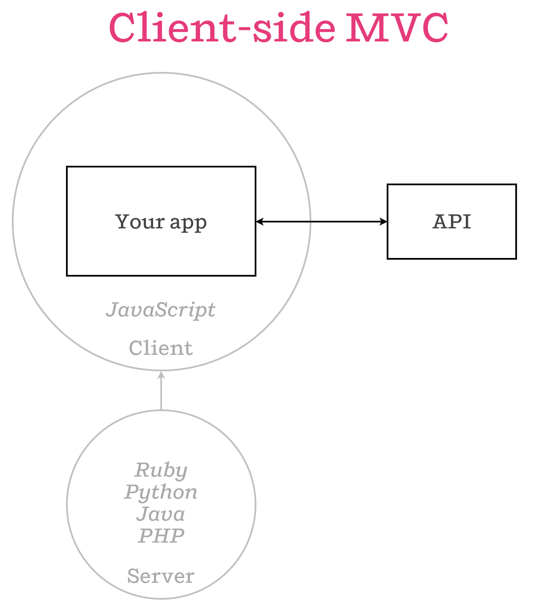
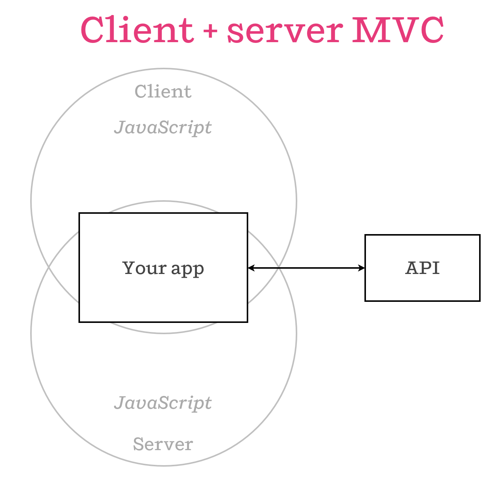

# React Redux Sever Rendering（Isomorphic）入門

## 前言
在進到後面開發 React Redux Sever Rendering 應用程式的主題之前我們先來聊聊 Isomorphic JavaScript 這個議題。

根據 [Isomorphic JavaScript](http://isomorphic.net/) 這個網站的說明：

>Isomorphic JavaScript
Isomorphic JavaScript apps are JavaScript applications that can run both client-side and server-side.
The backend and frontend share the same code. 

意思是說就是說 Isomorphic JavaScript 係指瀏覽器端和伺服器端共用了 JavaScript 的程式碼。

另外，Isomorphic JavaScript 外也有很多人提到 Universal JavaScript 這個用詞。那什麼是 Universal JavaScript 呢？它和 Isomorphic JavaScript 是指一樣的意思嗎？針對這個議題網路上有些開發提出了自己的觀點： [Universal JavaScript](https://medium.com/@mjackson/universal-javascript-4761051b7ae9#.67xsay73m)、[Isomorphism vs Universal JavaScript](https://medium.com/@ghengeveld/isomorphism-vs-universal-javascript-4b47fb481beb#.qvggcp3v8)。其中 Isomorphism vs Universal JavaScript 這篇文章的作者 Gert Hengeveld 指出 `Isomorphic JavaScript` 主要是指前後端共用 JavaScript 的開發方式，而 `Universal JavaScript` 可以視為 JavaScript 程式碼可以在不同環境下運行，這當然包含瀏覽器端和伺服器端，也就是 `Universal JavaScript` 在意義上可以涵蓋的比 `Isomorphic JavaScript` 更廣泛一些。然而在 Github 或是許多技術討論上通常會把兩者視為同一件事情，這部份也請讀者留意。

## Isomorphic JavaScript 的好處
在開始真正撰寫 Isomorphic JavaScript 前我們在進一步探討使用 Isomorphic JavaScript 有哪些好處？在談好處之前，我們先看看最早 Web 開發是如何處理頁面渲染和 state 管理，還有遇到哪些挑戰。

最早的時候我們談論 Web 很單純，都是由 Server 端進行模版的處理，你可以想成 template 是一個函數，我們傳送資料進去，template 最後產生一張 HTML 給瀏覽器顯示。例如：Node 使用的（[EJS](http://ejs.co/)、[Jade](http://jade-lang.com/)）、Django 的 [Template](https://docs.djangoproject.com/el/1.10/ref/templates/) 或替代方案[Jinja](https://github.com/pallets/jinja)、PHP 的 [Smarty](http://www.smarty.net/)、[Laravel](https://laravel.com/) 使用的 [Blade](https://laravel.com/docs/5.0/templates) 甚至是 Ruby on Rails 用的 [ERB](http://guides.rubyonrails.org/layouts_and_rendering.html)。都是由後端去 render 所有資料和頁面，前端處理相對單純。

然而隨著前端工程的軟體工程化和使用者體驗的要求，開始出現各式前端框架的百花齊放，例如：[Backbone.js](http://backbonejs.org/)、[Ember.js](http://emberjs.com/) 和 [Angular.js](https://angularjs.org/) 等前端 MVC (Model-View-Controller) 或 MVVM (Model-View-ViewModel) 框架，將頁面於前端渲染的不刷頁單頁式應用程式（Single Page App）也因此開始流行。

後端除了提供初始的 HTML 外，還提供 API Server 讓前端框架可以取得資料用於前端 template。複雜的邏輯由 ViewModel/Presenter 來處理，template 只處理簡單的是否顯示或是元素迭代的狀況，如下圖所示：



然而前端渲染 template 雖然有它的好處但也遇到一些問題包括效能、SEO 等議題。此時我們就開始思考 Isomorphic JavaScript 的可能性：為什麼我們不能前後端都使用 JavaScript 甚至是 React？



總的來說使用 Isomorphic JavaScript 會有以下的好處：

1. 有助於 SEO
2. Rendering 速度較快，效能較佳
3. 放棄蹩腳的 Template 語法擁抱 Component 元件化思考，便於維護
4. 盡量前後端共用程式碼節省開發時間

## Isomorphic JavaScript 初體驗
 
```
ReactDOMServer.renderToString(<HelloButton name="Mark" />);
```

```
<button data-reactid=".7" data-react-checksum="762752829">
  Hello, Mark
</button>
```

## 總結

## 延伸閱讀
1. [DavidWells/isomorphic-react-example](https://github.com/DavidWells/isomorphic-react-example)
2. [RickWong/react-isomorphic-starterkit](https://github.com/RickWong/react-isomorphic-starterkit)
3. [Server-rendered React components in Rails](https://www.bensmithett.com/server-rendered-react-components-in-rails/)
4. [Our First Node.js App: Backbone on the Client and Server](http://nerds.airbnb.com/weve-launched-our-first-nodejs-app-to-product/)
5. [Going Isomorphic with React](https://bensmithett.github.io/going-isomorphic-with-react/#/)
6. [A service for server-side rendering your JavaScript views](https://github.com/airbnb/hypernova)
7. [Isomorphic JavaScript: The Future of Web Apps](http://nerds.airbnb.com/isomorphic-javascript-future-web-apps/)

（image via [airbnb](http://nerds.airbnb.com/wp-content/uploads/2013/11/Screen-Shot-2013-11-06-at-5.21.00-PM.png)）